# Elastic Search 调优笔记

> 用户提供了一段原始的查询请求参数，根据原始的请求参数调整为期待的结果，比如在查询“比亚迪年报”时候，最先出现的是 关于比亚迪年报点评的结果。

## 分析

用户提供的原始查询语句如下:

```json
{
    "from": 0,
    "size": 10,
    "query": {
        "function_score": {
            "query": {
                "bool": {
                    "must": [
                        {
                            "bool": {
                                "must": [
                                    {
                                        "match": {
                                            "parse_title": {
                                                "query": "比亚迪营业收入",
                                                "operator": "OR",
                                                "prefix_length": 0,
                                                "max_expansions": 50,
                                                "fuzzy_transpositions": true,
                                                "lenient": false,
                                                "zero_terms_query": "NONE",
                                                "boost": 10.0
                                            }
                                        }
                                    },
                                    {
                                        "match": {
                                            "parse_keypoint": {
                                                "query": "比亚迪营业收入",
                                                "operator": "OR",
                                                "prefix_length": 0,
                                                "max_expansions": 50,
                                                "fuzzy_transpositions": true,
                                                "lenient": false,
                                                "zero_terms_query": "NONE",
                                                "boost": 5.0
                                            }
                                        }
                                    }
                                ],
                                "disable_coord": false,
                                "adjust_pure_negative": true,
                                "boost": 1.0
                            }
                        }
                    ],
                    "disable_coord": false,
                    "adjust_pure_negative": true,
                    "boost": 1.0
                }
            },
            "functions": [
                {
                    "filter": {
                        "term": {
                            "parse_type": {
                                "value": "衍生品",
                                "boost": 1.0
                            }
                        }
                    },
                    "weight": 5.0
                },
                {
                    "filter": {
                        "term": {
                            "parse_type": {
                                "value": "新三板",
                                "boost": 1.0
                            }
                        }
                    },
                    "weight": 3.0
                },
                {
                    "filter": {
                        "term": {
                            "parse_type": {
                                "value": "大宗商品",
                                "boost": 1.0
                            }
                        }
                    },
                    "weight": 5.0
                },
                {
                    "filter": {
                        "term": {
                            "parse_type": {
                                "value": "公司研究",
                                "boost": 1.0
                            }
                        }
                    },
                    "weight": 5.0
                },
                {
                    "filter": {
                        "term": {
                            "parse_type": {
                                "value": "宏观研究",
                                "boost": 1.0
                            }
                        }
                    },
                    "weight": 5.0
                },
                {
                    "filter": {
                        "term": {
                            "parse_type": {
                                "value": "外汇市场",
                                "boost": 1.0
                            }
                        }
                    },
                    "weight": 5.0
                },
                {
                    "filter": {
                        "term": {
                            "parse_type": {
                                "value": "策略研究",
                                "boost": 1.0
                            }
                        }
                    },
                    "weight": 5.0
                },
                {
                    "filter": {
                        "term": {
                            "parse_type": {
                                "value": "基金研究",
                                "boost": 1.0
                            }
                        }
                    },
                    "weight": 5.0
                },
                {
                    "filter": {
                        "term": {
                            "parse_type": {
                                "value": "海外市场",
                                "boost": 1.0
                            }
                        }
                    },
                    "weight": 5.0
                },
                {
                    "filter": {
                        "term": {
                            "parse_type": {
                                "value": "月报",
                                "boost": 1.0
                            }
                        }
                    },
                    "weight": 5.0
                },
                {
                    "filter": {
                        "term": {
                            "parse_type": {
                                "value": "中小市值",
                                "boost": 1.0
                            }
                        }
                    },
                    "weight": 5.0
                },
                {
                    "filter": {
                        "term": {
                            "parse_type": {
                                "value": "金融工程",
                                "boost": 1.0
                            }
                        }
                    },
                    "weight": 5.0
                },
                {
                    "filter": {
                        "term": {
                            "parse_type": {
                                "value": "周报",
                                "boost": 1.0
                            }
                        }
                    },
                    "weight": 4.0
                },
                {
                    "filter": {
                        "term": {
                            "parse_type": {
                                "value": "行业研究",
                                "boost": 1.0
                            }
                        }
                    },
                    "weight": 5.0
                },
                {
                    "filter": {
                        "term": {
                            "parse_type": {
                                "value": "固定收益",
                                "boost": 1.0
                            }
                        }
                    },
                    "weight": 5.0
                },
                {
                    "filter": {
                        "term": {
                            "parse_type": {
                                "value": "市场综述",
                                "boost": 1.0
                            }
                        }
                    },
                    "weight": 5.0
                },
                {
                    "filter": {
                        "term": {
                            "parse_orgnization": {
                                "value": "方正证券",
                                "boost": 1.0
                            }
                        }
                    },
                    "weight": 7.0
                },
                {
                    "filter": {
                        "term": {
                            "parse_orgnization": {
                                "value": "兴业证券",
                                "boost": 1.0
                            }
                        }
                    },
                    "weight": 8.0
                },
                {
                    "filter": {
                        "term": {
                            "parse_orgnization": {
                                "value": "申万宏源",
                                "boost": 1.0
                            }
                        }
                    },
                    "weight": 9.0
                },
                {
                    "filter": {
                        "term": {
                            "parse_orgnization": {
                                "value": "招商证券",
                                "boost": 1.0
                            }
                        }
                    },
                    "weight": 8.0
                },
                {
                    "filter": {
                        "term": {
                            "parse_orgnization": {
                                "value": "中金公司",
                                "boost": 1.0
                            }
                        }
                    },
                    "weight": 9.0
                },
                {
                    "filter": {
                        "term": {
                            "parse_orgnization": {
                                "value": "广发证券",
                                "boost": 1.0
                            }
                        }
                    },
                    "weight": 9.0
                },
                {
                    "filter": {
                        "term": {
                            "parse_orgnization": {
                                "value": "长江证券",
                                "boost": 1.0
                            }
                        }
                    },
                    "weight": 8.0
                },
                {
                    "filter": {
                        "term": {
                            "parse_orgnization": {
                                "value": "海通证券",
                                "boost": 1.0
                            }
                        }
                    },
                    "weight": 9.0
                },
                {
                    "filter": {
                        "term": {
                            "parse_orgnization": {
                                "value": "天风证券",
                                "boost": 1.0
                            }
                        }
                    },
                    "weight": 7.0
                },
                {
                    "filter": {
                        "term": {
                            "parse_orgnization": {
                                "value": "中信证券",
                                "boost": 1.0
                            }
                        }
                    },
                    "weight": 10.0
                },
                {
                    "filter": {
                        "term": {
                            "parse_orgnization": {
                                "value": "中信建投",
                                "boost": 1.0
                            }
                        }
                    },
                    "weight": 9.0
                },
                {
                    "filter": {
                        "term": {
                            "parse_orgnization": {
                                "value": "国泰君安",
                                "boost": 1.0
                            }
                        }
                    },
                    "weight": 9.0
                },
                {
                    "filter": {
                        "term": {
                            "parse_orgnization": {
                                "value": "华泰证券",
                                "boost": 1.0
                            }
                        }
                    },
                    "weight": 9.0
                },
                {
                    "filter": {
                        "term": {
                            "parse_orgnization": {
                                "value": "国信证券",
                                "boost": 1.0
                            }
                        }
                    },
                    "weight": 8.0
                },
                {
                    "filter": {
                        "term": {
                            "parse_orgnization": {
                                "value": "平安证券",
                                "boost": 1.0
                            }
                        }
                    },
                    "weight": 8.0
                },
                {
                    "filter": {
                        "term": {
                            "parse_orgnization": {
                                "value": "安信证券",
                                "boost": 1.0
                            }
                        }
                    },
                    "weight": 5.0
                },
                {
                    "filter": {
                        "match_all": {
                            "boost": 1.0
                        }
                    },
                    "weight": 1.0,
                    "exp": {
                        "parse_pagecount": {
                            "origin": 40,
                            "scale": 50,
                            "offset": 5,
                            "decay": 0.5
                        },
                        "multi_value_mode": "MIN"
                    }
                },
                {
                    "filter": {
                        "match_all": {
                            "boost": 1.0
                        }
                    },
                    "weight": 2.0,
                    "exp": {
                        "parse_reportdate": {
                            "origin": "now",
                            "scale": "180d",
                            "offset": "90d",
                            "decay": 0.5
                        },
                        "multi_value_mode": "MIN"
                    }
                }
            ],
            "score_mode": "sum",
            "boost_mode": "sum",
            "max_boost": 3.4028235E38,
            "min_score": 10.0,
            "boost": 1.0
        }
    },
    "_source": {
        "includes": [
            "parse_orgnization",
            "parse_authors",
            "parse_pagecount",
            "parse_reportdate",
            "parse_type",
            "tblname",
            "downloadedfilepath",
            "parse_title",
            "parse_keypoint",
            "parse_industry",
            "company"
        ],
        "excludes": []
    },
    "highlight": {
        "require_field_match": false,
        "fields": {
            "parse_title": {},
            "parse_keypoint": {}
        }
    }
}
```

查询结果如下图:

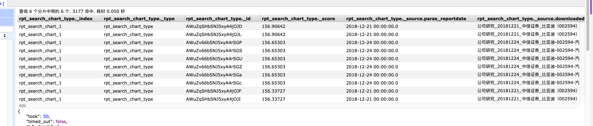

匹配的内容都跟比亚迪年报想去甚远。


## 修改查询语句中的协调因子

根据此链接 [https://www.elastic.co/guide/cn/elasticsearch/guide/current/practical-scoring-function.html](https://www.elastic.co/guide/cn/elasticsearch/guide/current/practical-scoring-function.html) **注意此链接是基于 2.x 版本，很多其实都有所改变。**


尝试修改协调因子:


```json
{
    "from": 0,
    "size": 10,
    "query": {
        "function_score": {
            "query": {
                "bool": {
                    "must": [
                        {
                            "bool": {
                                "must": [
                                    {
                                        "match": {
                                            "parse_title": {
                                                "query": "比亚迪营业收入",
                                                "operator": "OR",
                                                "prefix_length": 0,
                                                "max_expansions": 50,
                                                "fuzzy_transpositions": true,
                                                "lenient": false,
                                                "zero_terms_query": "NONE",
                                                "boost": 10.0
                                            }
                                        }
                                    },
                                    {
                                        "match": {
                                            "parse_keypoint": {
                                                "query": "比亚迪营业收入",
                                                "operator": "OR",
                                                "prefix_length": 0,
                                                "max_expansions": 50,
                                                "fuzzy_transpositions": true,
                                                "lenient": false,
                                                "zero_terms_query": "NONE",
                                                "boost": 5.0
                                            }
                                        }
                                    }
                                ],
                                "disable_coord": true,
                                "adjust_pure_negative": true,
                                "boost": 1.0
                            }
                        }
                    ],
                    "disable_coord": true,
                    "adjust_pure_negative": true,
                    "boost": 1.0
                }
            },
            "functions": [
                {
                    "filter": {
                        "term": {
                            "parse_type": {
                                "value": "衍生品",
                                "boost": 1.0
                            }
                        }
                    },
                    "weight": 5.0
                },
                {
                    "filter": {
                        "term": {
                            "parse_type": {
                                "value": "新三板",
                                "boost": 1.0
                            }
                        }
                    },
                    "weight": 3.0
                },
                {
                    "filter": {
                        "term": {
                            "parse_type": {
                                "value": "大宗商品",
                                "boost": 1.0
                            }
                        }
                    },
                    "weight": 5.0
                },
                {
                    "filter": {
                        "term": {
                            "parse_type": {
                                "value": "公司研究",
                                "boost": 1.0
                            }
                        }
                    },
                    "weight": 5.0
                },
                {
                    "filter": {
                        "term": {
                            "parse_type": {
                                "value": "宏观研究",
                                "boost": 1.0
                            }
                        }
                    },
                    "weight": 5.0
                },
                {
                    "filter": {
                        "term": {
                            "parse_type": {
                                "value": "外汇市场",
                                "boost": 1.0
                            }
                        }
                    },
                    "weight": 5.0
                },
                {
                    "filter": {
                        "term": {
                            "parse_type": {
                                "value": "策略研究",
                                "boost": 1.0
                            }
                        }
                    },
                    "weight": 5.0
                },
                {
                    "filter": {
                        "term": {
                            "parse_type": {
                                "value": "基金研究",
                                "boost": 1.0
                            }
                        }
                    },
                    "weight": 5.0
                },
                {
                    "filter": {
                        "term": {
                            "parse_type": {
                                "value": "海外市场",
                                "boost": 1.0
                            }
                        }
                    },
                    "weight": 5.0
                },
                {
                    "filter": {
                        "term": {
                            "parse_type": {
                                "value": "月报",
                                "boost": 1.0
                            }
                        }
                    },
                    "weight": 5.0
                },
                {
                    "filter": {
                        "term": {
                            "parse_type": {
                                "value": "中小市值",
                                "boost": 1.0
                            }
                        }
                    },
                    "weight": 5.0
                },
                {
                    "filter": {
                        "term": {
                            "parse_type": {
                                "value": "金融工程",
                                "boost": 1.0
                            }
                        }
                    },
                    "weight": 5.0
                },
                {
                    "filter": {
                        "term": {
                            "parse_type": {
                                "value": "周报",
                                "boost": 1.0
                            }
                        }
                    },
                    "weight": 4.0
                },
                {
                    "filter": {
                        "term": {
                            "parse_type": {
                                "value": "行业研究",
                                "boost": 1.0
                            }
                        }
                    },
                    "weight": 5.0
                },
                {
                    "filter": {
                        "term": {
                            "parse_type": {
                                "value": "固定收益",
                                "boost": 1.0
                            }
                        }
                    },
                    "weight": 5.0
                },
                {
                    "filter": {
                        "term": {
                            "parse_type": {
                                "value": "市场综述",
                                "boost": 1.0
                            }
                        }
                    },
                    "weight": 5.0
                },
                {
                    "filter": {
                        "term": {
                            "parse_orgnization": {
                                "value": "方正证券",
                                "boost": 1.0
                            }
                        }
                    },
                    "weight": 7.0
                },
                {
                    "filter": {
                        "term": {
                            "parse_orgnization": {
                                "value": "兴业证券",
                                "boost": 1.0
                            }
                        }
                    },
                    "weight": 8.0
                },
                {
                    "filter": {
                        "term": {
                            "parse_orgnization": {
                                "value": "申万宏源",
                                "boost": 1.0
                            }
                        }
                    },
                    "weight": 9.0
                },
                {
                    "filter": {
                        "term": {
                            "parse_orgnization": {
                                "value": "招商证券",
                                "boost": 1.0
                            }
                        }
                    },
                    "weight": 8.0
                },
                {
                    "filter": {
                        "term": {
                            "parse_orgnization": {
                                "value": "中金公司",
                                "boost": 1.0
                            }
                        }
                    },
                    "weight": 9.0
                },
                {
                    "filter": {
                        "term": {
                            "parse_orgnization": {
                                "value": "广发证券",
                                "boost": 1.0
                            }
                        }
                    },
                    "weight": 9.0
                },
                {
                    "filter": {
                        "term": {
                            "parse_orgnization": {
                                "value": "长江证券",
                                "boost": 1.0
                            }
                        }
                    },
                    "weight": 8.0
                },
                {
                    "filter": {
                        "term": {
                            "parse_orgnization": {
                                "value": "海通证券",
                                "boost": 1.0
                            }
                        }
                    },
                    "weight": 9.0
                },
                {
                    "filter": {
                        "term": {
                            "parse_orgnization": {
                                "value": "天风证券",
                                "boost": 1.0
                            }
                        }
                    },
                    "weight": 7.0
                },
                {
                    "filter": {
                        "term": {
                            "parse_orgnization": {
                                "value": "中信证券",
                                "boost": 1.0
                            }
                        }
                    },
                    "weight": 10.0
                },
                {
                    "filter": {
                        "term": {
                            "parse_orgnization": {
                                "value": "中信建投",
                                "boost": 1.0
                            }
                        }
                    },
                    "weight": 9.0
                },
                {
                    "filter": {
                        "term": {
                            "parse_orgnization": {
                                "value": "国泰君安",
                                "boost": 1.0
                            }
                        }
                    },
                    "weight": 9.0
                },
                {
                    "filter": {
                        "term": {
                            "parse_orgnization": {
                                "value": "华泰证券",
                                "boost": 1.0
                            }
                        }
                    },
                    "weight": 9.0
                },
                {
                    "filter": {
                        "term": {
                            "parse_orgnization": {
                                "value": "国信证券",
                                "boost": 1.0
                            }
                        }
                    },
                    "weight": 8.0
                },
                {
                    "filter": {
                        "term": {
                            "parse_orgnization": {
                                "value": "平安证券",
                                "boost": 1.0
                            }
                        }
                    },
                    "weight": 8.0
                },
                {
                    "filter": {
                        "term": {
                            "parse_orgnization": {
                                "value": "安信证券",
                                "boost": 1.0
                            }
                        }
                    },
                    "weight": 5.0
                },
                {
                    "filter": {
                        "match_all": {
                            "boost": 1.0
                        }
                    },
                    "weight": 1.0,
                    "exp": {
                        "parse_pagecount": {
                            "origin": 40,
                            "scale": 50,
                            "offset": 5,
                            "decay": 0.5
                        },
                        "multi_value_mode": "MIN"
                    }
                },
                {
                    "filter": {
                        "match_all": {
                            "boost": 1.0
                        }
                    },
                    "weight": 2.0,
                    "exp": {
                        "parse_reportdate": {
                            "origin": "now",
                            "scale": "180d",
                            "offset": "90d",
                            "decay": 0.5
                        },
                        "multi_value_mode": "MIN"
                    }
                }
            ],
            "score_mode": "sum",
            "boost_mode": "sum",
            "max_boost": 3.4028235E38,
            "min_score": 10.0,
            "boost": 1.0
        }
    },
    "_source": {
        "includes": [
            "parse_orgnization",
            "parse_authors",
            "parse_pagecount",
            "parse_reportdate",
            "parse_type",
            "tblname",
            "downloadedfilepath",
            "parse_title",
            "parse_keypoint",
            "parse_industry",
            "company"
        ],
        "excludes": []
    },
    "highlight": {
        "require_field_match": false,
        "fields": {
            "parse_title": {},
            "parse_keypoint": {}
        }
    }
}
```

查询结果如下:

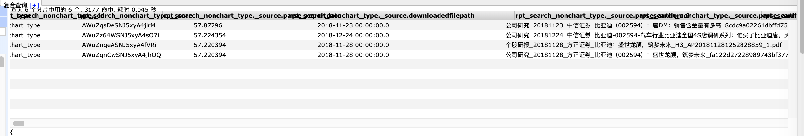


可以对比之前的图看到，以上修改**完全没有**起到应该的作用。


## 修改查询中频率影响因子

考虑到可能某些文章内反复提及某些关键词能显著提高查询的命中率，尝试在查询中去除此影响，至少在 title 中试一下去除此影响。


```json
{
    "from": 0,
    "size": 10,
    "query": {
        "function_score": {
            "query": {
                "bool": {
                    "must": [
                        {
                            "bool": {
                                "must": [
                                    {
                                        "constant_score": {
                                            "filter": {
                                                "match": {
                                                    "parse_title": {
                                                        "query": "比亚迪营业收入",
                                                        "operator": "OR",
                                                        "prefix_length": 0,
                                                        "max_expansions": 50,
                                                        "fuzzy_transpositions": true,
                                                        "lenient": false,
                                                        "zero_terms_query": "NONE",
                                                        "boost": 10.0
                                                    }
                                                }
                                            }
                                        }
                                    },
                                    {
                                        "match": {
                                            "parse_keypoint": {
                                                "query": "比亚迪营业收入",
                                                "operator": "OR",
                                                "prefix_length": 0,
                                                "max_expansions": 50,
                                                "fuzzy_transpositions": true,
                                                "lenient": false,
                                                "zero_terms_query": "NONE",
                                                "boost": 5.0
                                            }
                                        }
                                    }
                                ],
                                "disable_coord": true,
                                "adjust_pure_negative": true,
                                "boost": 1.0
                            }
                        }
                    ],
                    "disable_coord": true,
                    "adjust_pure_negative": true,
                    "boost": 1.0
                }
            },
            "functions": [
                {
                    "filter": {
                        "term": {
                            "parse_type": {
                                "value": "衍生品",
                                "boost": 1.0
                            }
                        }
                    },
                    "weight": 5.0
                },
                {
                    "filter": {
                        "term": {
                            "parse_type": {
                                "value": "新三板",
                                "boost": 1.0
                            }
                        }
                    },
                    "weight": 3.0
                },
                {
                    "filter": {
                        "term": {
                            "parse_type": {
                                "value": "大宗商品",
                                "boost": 1.0
                            }
                        }
                    },
                    "weight": 5.0
                },
                {
                    "filter": {
                        "term": {
                            "parse_type": {
                                "value": "公司研究",
                                "boost": 1.0
                            }
                        }
                    },
                    "weight": 5.0
                },
                {
                    "filter": {
                        "term": {
                            "parse_type": {
                                "value": "宏观研究",
                                "boost": 1.0
                            }
                        }
                    },
                    "weight": 5.0
                },
                {
                    "filter": {
                        "term": {
                            "parse_type": {
                                "value": "外汇市场",
                                "boost": 1.0
                            }
                        }
                    },
                    "weight": 5.0
                },
                {
                    "filter": {
                        "term": {
                            "parse_type": {
                                "value": "策略研究",
                                "boost": 1.0
                            }
                        }
                    },
                    "weight": 5.0
                },
                {
                    "filter": {
                        "term": {
                            "parse_type": {
                                "value": "基金研究",
                                "boost": 1.0
                            }
                        }
                    },
                    "weight": 5.0
                },
                {
                    "filter": {
                        "term": {
                            "parse_type": {
                                "value": "海外市场",
                                "boost": 1.0
                            }
                        }
                    },
                    "weight": 5.0
                },
                {
                    "filter": {
                        "term": {
                            "parse_type": {
                                "value": "月报",
                                "boost": 1.0
                            }
                        }
                    },
                    "weight": 5.0
                },
                {
                    "filter": {
                        "term": {
                            "parse_type": {
                                "value": "中小市值",
                                "boost": 1.0
                            }
                        }
                    },
                    "weight": 5.0
                },
                {
                    "filter": {
                        "term": {
                            "parse_type": {
                                "value": "金融工程",
                                "boost": 1.0
                            }
                        }
                    },
                    "weight": 5.0
                },
                {
                    "filter": {
                        "term": {
                            "parse_type": {
                                "value": "周报",
                                "boost": 1.0
                            }
                        }
                    },
                    "weight": 4.0
                },
                {
                    "filter": {
                        "term": {
                            "parse_type": {
                                "value": "行业研究",
                                "boost": 1.0
                            }
                        }
                    },
                    "weight": 5.0
                },
                {
                    "filter": {
                        "term": {
                            "parse_type": {
                                "value": "固定收益",
                                "boost": 1.0
                            }
                        }
                    },
                    "weight": 5.0
                },
                {
                    "filter": {
                        "term": {
                            "parse_type": {
                                "value": "市场综述",
                                "boost": 1.0
                            }
                        }
                    },
                    "weight": 5.0
                },
                {
                    "filter": {
                        "term": {
                            "parse_orgnization": {
                                "value": "方正证券",
                                "boost": 1.0
                            }
                        }
                    },
                    "weight": 7.0
                },
                {
                    "filter": {
                        "term": {
                            "parse_orgnization": {
                                "value": "兴业证券",
                                "boost": 1.0
                            }
                        }
                    },
                    "weight": 8.0
                },
                {
                    "filter": {
                        "term": {
                            "parse_orgnization": {
                                "value": "申万宏源",
                                "boost": 1.0
                            }
                        }
                    },
                    "weight": 9.0
                },
                {
                    "filter": {
                        "term": {
                            "parse_orgnization": {
                                "value": "招商证券",
                                "boost": 1.0
                            }
                        }
                    },
                    "weight": 8.0
                },
                {
                    "filter": {
                        "term": {
                            "parse_orgnization": {
                                "value": "中金公司",
                                "boost": 1.0
                            }
                        }
                    },
                    "weight": 9.0
                },
                {
                    "filter": {
                        "term": {
                            "parse_orgnization": {
                                "value": "广发证券",
                                "boost": 1.0
                            }
                        }
                    },
                    "weight": 9.0
                },
                {
                    "filter": {
                        "term": {
                            "parse_orgnization": {
                                "value": "长江证券",
                                "boost": 1.0
                            }
                        }
                    },
                    "weight": 8.0
                },
                {
                    "filter": {
                        "term": {
                            "parse_orgnization": {
                                "value": "海通证券",
                                "boost": 1.0
                            }
                        }
                    },
                    "weight": 9.0
                },
                {
                    "filter": {
                        "term": {
                            "parse_orgnization": {
                                "value": "天风证券",
                                "boost": 1.0
                            }
                        }
                    },
                    "weight": 7.0
                },
                {
                    "filter": {
                        "term": {
                            "parse_orgnization": {
                                "value": "中信证券",
                                "boost": 1.0
                            }
                        }
                    },
                    "weight": 10.0
                },
                {
                    "filter": {
                        "term": {
                            "parse_orgnization": {
                                "value": "中信建投",
                                "boost": 1.0
                            }
                        }
                    },
                    "weight": 9.0
                },
                {
                    "filter": {
                        "term": {
                            "parse_orgnization": {
                                "value": "国泰君安",
                                "boost": 1.0
                            }
                        }
                    },
                    "weight": 9.0
                },
                {
                    "filter": {
                        "term": {
                            "parse_orgnization": {
                                "value": "华泰证券",
                                "boost": 1.0
                            }
                        }
                    },
                    "weight": 9.0
                },
                {
                    "filter": {
                        "term": {
                            "parse_orgnization": {
                                "value": "国信证券",
                                "boost": 1.0
                            }
                        }
                    },
                    "weight": 8.0
                },
                {
                    "filter": {
                        "term": {
                            "parse_orgnization": {
                                "value": "平安证券",
                                "boost": 1.0
                            }
                        }
                    },
                    "weight": 8.0
                },
                {
                    "filter": {
                        "term": {
                            "parse_orgnization": {
                                "value": "安信证券",
                                "boost": 1.0
                            }
                        }
                    },
                    "weight": 5.0
                },
                {
                    "filter": {
                        "match_all": {
                            "boost": 1.0
                        }
                    },
                    "weight": 1.0,
                    "exp": {
                        "parse_pagecount": {
                            "origin": 40,
                            "scale": 50,
                            "offset": 5,
                            "decay": 0.5
                        },
                        "multi_value_mode": "MIN"
                    }
                },
                {
                    "filter": {
                        "match_all": {
                            "boost": 1.0
                        }
                    },
                    "weight": 2.0,
                    "exp": {
                        "parse_reportdate": {
                            "origin": "now",
                            "scale": "180d",
                            "offset": "90d",
                            "decay": 0.5
                        },
                        "multi_value_mode": "MIN"
                    }
                }
            ],
            "score_mode": "sum",
            "boost_mode": "sum",
            "max_boost": 3.4028235E38,
            "min_score": 10.0,
            "boost": 1.0
        }
    },
    "_source": {
        "includes": [
            "parse_orgnization",
            "parse_authors",
            "parse_pagecount",
            "parse_reportdate",
            "parse_type",
            "tblname",
            "downloadedfilepath",
            "parse_title",
            "parse_keypoint",
            "parse_industry",
            "company"
        ],
        "excludes": []
    },
    "highlight": {
        "require_field_match": false,
        "fields": {
            "parse_title": {},
            "parse_keypoint": {}
        }
    }
}
```

查询结果如下:


可以看出查询分数虽然有所变化，但是查询的结果还是不够满意，我们需要看一下具体是哪里分数不正常。


经过查看 explain 发现，是因为我们只在title 中添加了 constant score，所以在body中拥有较多名字的则占尽优势。

## 修改查询中 body 的频率影响因子

查询语句如下（**语句中包含 `explain`**)


```json
{
    "from": 0,
    "size": 10,
    "explain": true,
    "query": {
        "function_score": {
            "query": {
                "bool": {
                    "must": [
                        {
                            "bool": {
                                "must": [
                                    {
                                        "constant_score": {
                                            "filter": {
                                                "match": {
                                                    "parse_title": {
                                                        "query": "比亚迪营业收入",
                                                        "operator": "OR",
                                                        "prefix_length": 0,
                                                        "max_expansions": 50,
                                                        "fuzzy_transpositions": true,
                                                        "lenient": false,
                                                        "zero_terms_query": "NONE",
                                                        "boost": 10
                                                    }
                                                }
                                            }
                                        }
                                    },
                                    {
                                        "constant_score": {
                                            "filter": {
                                                "match": {
                                                    "parse_keypoint": {
                                                        "query": "比亚迪营业收入",
                                                        "operator": "OR",
                                                        "prefix_length": 0,
                                                        "max_expansions": 50,
                                                        "fuzzy_transpositions": true,
                                                        "lenient": false,
                                                        "zero_terms_query": "NONE",
                                                        "boost": 5
                                                    }
                                                }
                                            }
                                        }
                                    }
                                ],
                                "disable_coord": true,
                                "adjust_pure_negative": true,
                                "boost": 1
                            }
                        }
                    ],
                    "disable_coord": true,
                    "adjust_pure_negative": true,
                    "boost": 1
                }
            },
            "functions": [
                {
                    "filter": {
                        "term": {
                            "parse_type": {
                                "value": "衍生品",
                                "boost": 1
                            }
                        }
                    },
                    "weight": 5
                },
                {
                    "filter": {
                        "term": {
                            "parse_type": {
                                "value": "新三板",
                                "boost": 1
                            }
                        }
                    },
                    "weight": 3
                },
                {
                    "filter": {
                        "term": {
                            "parse_type": {
                                "value": "大宗商品",
                                "boost": 1
                            }
                        }
                    },
                    "weight": 5
                },
                {
                    "filter": {
                        "term": {
                            "parse_type": {
                                "value": "公司研究",
                                "boost": 1
                            }
                        }
                    },
                    "weight": 5
                },
                {
                    "filter": {
                        "term": {
                            "parse_type": {
                                "value": "宏观研究",
                                "boost": 1
                            }
                        }
                    },
                    "weight": 5
                },
                {
                    "filter": {
                        "term": {
                            "parse_type": {
                                "value": "外汇市场",
                                "boost": 1
                            }
                        }
                    },
                    "weight": 5
                },
                {
                    "filter": {
                        "term": {
                            "parse_type": {
                                "value": "策略研究",
                                "boost": 1
                            }
                        }
                    },
                    "weight": 5
                },
                {
                    "filter": {
                        "term": {
                            "parse_type": {
                                "value": "基金研究",
                                "boost": 1
                            }
                        }
                    },
                    "weight": 5
                },
                {
                    "filter": {
                        "term": {
                            "parse_type": {
                                "value": "海外市场",
                                "boost": 1
                            }
                        }
                    },
                    "weight": 5
                },
                {
                    "filter": {
                        "term": {
                            "parse_type": {
                                "value": "月报",
                                "boost": 1
                            }
                        }
                    },
                    "weight": 5
                },
                {
                    "filter": {
                        "term": {
                            "parse_type": {
                                "value": "中小市值",
                                "boost": 1
                            }
                        }
                    },
                    "weight": 5
                },
                {
                    "filter": {
                        "term": {
                            "parse_type": {
                                "value": "金融工程",
                                "boost": 1
                            }
                        }
                    },
                    "weight": 5
                },
                {
                    "filter": {
                        "term": {
                            "parse_type": {
                                "value": "周报",
                                "boost": 1
                            }
                        }
                    },
                    "weight": 4
                },
                {
                    "filter": {
                        "term": {
                            "parse_type": {
                                "value": "行业研究",
                                "boost": 1
                            }
                        }
                    },
                    "weight": 5
                },
                {
                    "filter": {
                        "term": {
                            "parse_type": {
                                "value": "固定收益",
                                "boost": 1
                            }
                        }
                    },
                    "weight": 5
                },
                {
                    "filter": {
                        "term": {
                            "parse_type": {
                                "value": "市场综述",
                                "boost": 1
                            }
                        }
                    },
                    "weight": 5
                },
                {
                    "filter": {
                        "term": {
                            "parse_orgnization": {
                                "value": "方正证券",
                                "boost": 1
                            }
                        }
                    },
                    "weight": 7
                },
                {
                    "filter": {
                        "term": {
                            "parse_orgnization": {
                                "value": "兴业证券",
                                "boost": 1
                            }
                        }
                    },
                    "weight": 8
                },
                {
                    "filter": {
                        "term": {
                            "parse_orgnization": {
                                "value": "申万宏源",
                                "boost": 1
                            }
                        }
                    },
                    "weight": 9
                },
                {
                    "filter": {
                        "term": {
                            "parse_orgnization": {
                                "value": "招商证券",
                                "boost": 1
                            }
                        }
                    },
                    "weight": 8
                },
                {
                    "filter": {
                        "term": {
                            "parse_orgnization": {
                                "value": "中金公司",
                                "boost": 1
                            }
                        }
                    },
                    "weight": 9
                },
                {
                    "filter": {
                        "term": {
                            "parse_orgnization": {
                                "value": "广发证券",
                                "boost": 1
                            }
                        }
                    },
                    "weight": 9
                },
                {
                    "filter": {
                        "term": {
                            "parse_orgnization": {
                                "value": "长江证券",
                                "boost": 1
                            }
                        }
                    },
                    "weight": 8
                },
                {
                    "filter": {
                        "term": {
                            "parse_orgnization": {
                                "value": "海通证券",
                                "boost": 1
                            }
                        }
                    },
                    "weight": 9
                },
                {
                    "filter": {
                        "term": {
                            "parse_orgnization": {
                                "value": "天风证券",
                                "boost": 1
                            }
                        }
                    },
                    "weight": 7
                },
                {
                    "filter": {
                        "term": {
                            "parse_orgnization": {
                                "value": "中信证券",
                                "boost": 1
                            }
                        }
                    },
                    "weight": 10
                },
                {
                    "filter": {
                        "term": {
                            "parse_orgnization": {
                                "value": "中信建投",
                                "boost": 1
                            }
                        }
                    },
                    "weight": 9
                },
                {
                    "filter": {
                        "term": {
                            "parse_orgnization": {
                                "value": "国泰君安",
                                "boost": 1
                            }
                        }
                    },
                    "weight": 9
                },
                {
                    "filter": {
                        "term": {
                            "parse_orgnization": {
                                "value": "华泰证券",
                                "boost": 1
                            }
                        }
                    },
                    "weight": 9
                },
                {
                    "filter": {
                        "term": {
                            "parse_orgnization": {
                                "value": "国信证券",
                                "boost": 1
                            }
                        }
                    },
                    "weight": 8
                },
                {
                    "filter": {
                        "term": {
                            "parse_orgnization": {
                                "value": "平安证券",
                                "boost": 1
                            }
                        }
                    },
                    "weight": 8
                },
                {
                    "filter": {
                        "term": {
                            "parse_orgnization": {
                                "value": "安信证券",
                                "boost": 1
                            }
                        }
                    },
                    "weight": 5
                },
                {
                    "filter": {
                        "match_all": {
                            "boost": 1
                        }
                    },
                    "weight": 1,
                    "exp": {
                        "parse_pagecount": {
                            "origin": 40,
                            "scale": 50,
                            "offset": 5,
                            "decay": 0.5
                        },
                        "multi_value_mode": "MIN"
                    }
                },
                {
                    "filter": {
                        "match_all": {
                            "boost": 1
                        }
                    },
                    "weight": 2,
                    "exp": {
                        "parse_reportdate": {
                            "origin": "now",
                            "scale": "180d",
                            "offset": "90d",
                            "decay": 0.5
                        },
                        "multi_value_mode": "MIN"
                    }
                }
            ],
            "score_mode": "sum",
            "boost_mode": "sum",
            "max_boost": 3.4028235e+38,
            "min_score": 10,
            "boost": 1
        }
    },
    "_source": {
        "includes": [
            "parse_orgnization",
            "parse_authors",
            "parse_pagecount",
            "parse_reportdate",
            "parse_type",
            "tblname",
            "downloadedfilepath",
            "parse_title",
            "parse_keypoint",
            "parse_industry",
            "company"
        ],
        "excludes": []
    },
    "highlight": {
        "require_field_match": false,
        "fields": {
            "parse_title": {},
            "parse_keypoint": {}
        }
    }
}
```

查询结果截图:

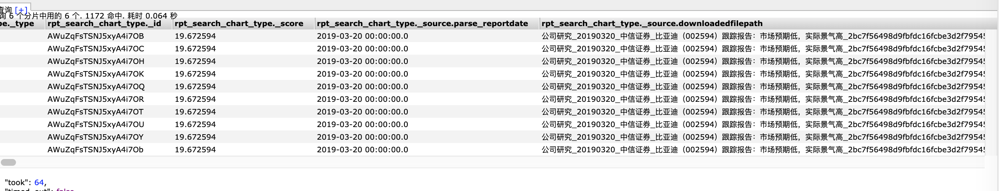


这次的返回结果跟之前不同了，但是还是不能达到我们的要求，使用 explain 查看后发现后面的 boost 提供了很多的分值。


尝试提高boost


## 修改 title 和 body 中 boost 的值


分别修改为 10,20


查询语句:


```json
{
    "from": 0,
    "size": 10,
    "explain": true,
    "query": {
        "function_score": {
            "query": {
                "bool": {
                    "must": [
                        {
                            "bool": {
                                "must": [
                                    {
                                        "constant_score": {
                                            "filter": {
                                                "match": {
                                                    "parse_title": {
                                                        "query": "比亚迪营业收入",
                                                        "operator": "OR",
                                                        "prefix_length": 0,
                                                        "max_expansions": 50,
                                                        "fuzzy_transpositions": true,
                                                        "lenient": false,
                                                        "zero_terms_query": "NONE",
                                                        "boost": 20
                                                    }
                                                }
                                            }
                                        }
                                    },
                                    {
                                        "constant_score": {
                                            "filter": {
                                                "match": {
                                                    "parse_keypoint": {
                                                        "query": "比亚迪营业收入",
                                                        "operator": "OR",
                                                        "prefix_length": 0,
                                                        "max_expansions": 50,
                                                        "fuzzy_transpositions": true,
                                                        "lenient": false,
                                                        "zero_terms_query": "NONE",
                                                        "boost": 10
                                                    }
                                                }
                                            }
                                        }
                                    }
                                ],
                                "disable_coord": true,
                                "adjust_pure_negative": true,
                                "boost": 1
                            }
                        }
                    ],
                    "disable_coord": true,
                    "adjust_pure_negative": true,
                    "boost": 1
                }
            },
            "functions": [
                {
                    "filter": {
                        "term": {
                            "parse_type": {
                                "value": "衍生品",
                                "boost": 1
                            }
                        }
                    },
                    "weight": 5
                },
                {
                    "filter": {
                        "term": {
                            "parse_type": {
                                "value": "新三板",
                                "boost": 1
                            }
                        }
                    },
                    "weight": 3
                },
                {
                    "filter": {
                        "term": {
                            "parse_type": {
                                "value": "大宗商品",
                                "boost": 1
                            }
                        }
                    },
                    "weight": 5
                },
                {
                    "filter": {
                        "term": {
                            "parse_type": {
                                "value": "公司研究",
                                "boost": 1
                            }
                        }
                    },
                    "weight": 5
                },
                {
                    "filter": {
                        "term": {
                            "parse_type": {
                                "value": "宏观研究",
                                "boost": 1
                            }
                        }
                    },
                    "weight": 5
                },
                {
                    "filter": {
                        "term": {
                            "parse_type": {
                                "value": "外汇市场",
                                "boost": 1
                            }
                        }
                    },
                    "weight": 5
                },
                {
                    "filter": {
                        "term": {
                            "parse_type": {
                                "value": "策略研究",
                                "boost": 1
                            }
                        }
                    },
                    "weight": 5
                },
                {
                    "filter": {
                        "term": {
                            "parse_type": {
                                "value": "基金研究",
                                "boost": 1
                            }
                        }
                    },
                    "weight": 5
                },
                {
                    "filter": {
                        "term": {
                            "parse_type": {
                                "value": "海外市场",
                                "boost": 1
                            }
                        }
                    },
                    "weight": 5
                },
                {
                    "filter": {
                        "term": {
                            "parse_type": {
                                "value": "月报",
                                "boost": 1
                            }
                        }
                    },
                    "weight": 5
                },
                {
                    "filter": {
                        "term": {
                            "parse_type": {
                                "value": "中小市值",
                                "boost": 1
                            }
                        }
                    },
                    "weight": 5
                },
                {
                    "filter": {
                        "term": {
                            "parse_type": {
                                "value": "金融工程",
                                "boost": 1
                            }
                        }
                    },
                    "weight": 5
                },
                {
                    "filter": {
                        "term": {
                            "parse_type": {
                                "value": "周报",
                                "boost": 1
                            }
                        }
                    },
                    "weight": 4
                },
                {
                    "filter": {
                        "term": {
                            "parse_type": {
                                "value": "行业研究",
                                "boost": 1
                            }
                        }
                    },
                    "weight": 5
                },
                {
                    "filter": {
                        "term": {
                            "parse_type": {
                                "value": "固定收益",
                                "boost": 1
                            }
                        }
                    },
                    "weight": 5
                },
                {
                    "filter": {
                        "term": {
                            "parse_type": {
                                "value": "市场综述",
                                "boost": 1
                            }
                        }
                    },
                    "weight": 5
                },
                {
                    "filter": {
                        "term": {
                            "parse_orgnization": {
                                "value": "方正证券",
                                "boost": 1
                            }
                        }
                    },
                    "weight": 7
                },
                {
                    "filter": {
                        "term": {
                            "parse_orgnization": {
                                "value": "兴业证券",
                                "boost": 1
                            }
                        }
                    },
                    "weight": 8
                },
                {
                    "filter": {
                        "term": {
                            "parse_orgnization": {
                                "value": "申万宏源",
                                "boost": 1
                            }
                        }
                    },
                    "weight": 9
                },
                {
                    "filter": {
                        "term": {
                            "parse_orgnization": {
                                "value": "招商证券",
                                "boost": 1
                            }
                        }
                    },
                    "weight": 8
                },
                {
                    "filter": {
                        "term": {
                            "parse_orgnization": {
                                "value": "中金公司",
                                "boost": 1
                            }
                        }
                    },
                    "weight": 9
                },
                {
                    "filter": {
                        "term": {
                            "parse_orgnization": {
                                "value": "广发证券",
                                "boost": 1
                            }
                        }
                    },
                    "weight": 9
                },
                {
                    "filter": {
                        "term": {
                            "parse_orgnization": {
                                "value": "长江证券",
                                "boost": 1
                            }
                        }
                    },
                    "weight": 8
                },
                {
                    "filter": {
                        "term": {
                            "parse_orgnization": {
                                "value": "海通证券",
                                "boost": 1
                            }
                        }
                    },
                    "weight": 9
                },
                {
                    "filter": {
                        "term": {
                            "parse_orgnization": {
                                "value": "天风证券",
                                "boost": 1
                            }
                        }
                    },
                    "weight": 7
                },
                {
                    "filter": {
                        "term": {
                            "parse_orgnization": {
                                "value": "中信证券",
                                "boost": 1
                            }
                        }
                    },
                    "weight": 10
                },
                {
                    "filter": {
                        "term": {
                            "parse_orgnization": {
                                "value": "中信建投",
                                "boost": 1
                            }
                        }
                    },
                    "weight": 9
                },
                {
                    "filter": {
                        "term": {
                            "parse_orgnization": {
                                "value": "国泰君安",
                                "boost": 1
                            }
                        }
                    },
                    "weight": 9
                },
                {
                    "filter": {
                        "term": {
                            "parse_orgnization": {
                                "value": "华泰证券",
                                "boost": 1
                            }
                        }
                    },
                    "weight": 9
                },
                {
                    "filter": {
                        "term": {
                            "parse_orgnization": {
                                "value": "国信证券",
                                "boost": 1
                            }
                        }
                    },
                    "weight": 8
                },
                {
                    "filter": {
                        "term": {
                            "parse_orgnization": {
                                "value": "平安证券",
                                "boost": 1
                            }
                        }
                    },
                    "weight": 8
                },
                {
                    "filter": {
                        "term": {
                            "parse_orgnization": {
                                "value": "安信证券",
                                "boost": 1
                            }
                        }
                    },
                    "weight": 5
                },
                {
                    "filter": {
                        "match_all": {
                            "boost": 1
                        }
                    },
                    "weight": 1,
                    "exp": {
                        "parse_pagecount": {
                            "origin": 40,
                            "scale": 50,
                            "offset": 5,
                            "decay": 0.5
                        },
                        "multi_value_mode": "MIN"
                    }
                },
                {
                    "filter": {
                        "match_all": {
                            "boost": 1
                        }
                    },
                    "weight": 2,
                    "exp": {
                        "parse_reportdate": {
                            "origin": "now",
                            "scale": "180d",
                            "offset": "90d",
                            "decay": 0.5
                        },
                        "multi_value_mode": "MIN"
                    }
                }
            ],
            "score_mode": "sum",
            "boost_mode": "sum",
            "max_boost": 3.4028235e+38,
            "min_score": 10,
            "boost": 1
        }
    },
    "_source": {
        "includes": [
            "parse_orgnization",
            "parse_authors",
            "parse_pagecount",
            "parse_reportdate",
            "parse_type",
            "tblname",
            "downloadedfilepath",
            "parse_title",
            "parse_keypoint",
            "parse_industry",
            "company"
        ],
        "excludes": []
    },
    "highlight": {
        "require_field_match": false,
        "fields": {
            "parse_title": {},
            "parse_keypoint": {}
        }
    }
}
```

查询结果


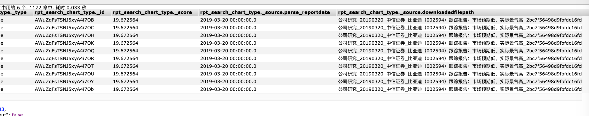

可以看到，这个结果跟上面的没两样，这个时候我们的优化就进入到一个死胡同，是不是该继续顺着这条线优化下去呢？


可以看到，使用对方的语句，虽然查询的相关性不够，但是在查询的时候还是能够正常的返回的，但是我们现在的返回值内容相关性比之前差了很多。


## 查看更多返回数据

```json
{
  "from": 0,
  "size": 30,
  "query": {
    "function_score": {
      "query": {
        "bool": {
          "must": [
            {
              "bool": {
                "must": [
                  {
                    "match": {
                      "parse_title": {
                        "query": "比亚迪营业收入",
                        "operator": "OR",
                        "prefix_length": 0,
                        "max_expansions": 50,
                        "fuzzy_transpositions": true,
                        "lenient": false,
                        "zero_terms_query": "NONE",
                        "boost": 10
                      }
                    }
                  },
                  {
                    "match": {
                      "parse_keypoint": {
                        "query": "比亚迪营业收入",
                        "operator": "OR",
                        "prefix_length": 0,
                        "max_expansions": 50,
                        "fuzzy_transpositions": true,
                        "lenient": false,
                        "zero_terms_query": "NONE",
                        "boost": 5
                      }
                    }
                  }
                ],
                "disable_coord": false,
                "adjust_pure_negative": true,
                "boost": 1
              }
            }
          ],
          "disable_coord": false,
          "adjust_pure_negative": true,
          "boost": 1
        }
      },
      "functions": [
        {
          "filter": {
            "term": {
              "parse_type": {
                "value": "衍生品",
                "boost": 1
              }
            }
          },
          "weight": 5
        },
        {
          "filter": {
            "term": {
              "parse_type": {
                "value": "新三板",
                "boost": 1
              }
            }
          },
          "weight": 3
        },
        {
          "filter": {
            "term": {
              "parse_type": {
                "value": "大宗商品",
                "boost": 1
              }
            }
          },
          "weight": 5
        },
        {
          "filter": {
            "term": {
              "parse_type": {
                "value": "公司研究",
                "boost": 1
              }
            }
          },
          "weight": 5
        },
        {
          "filter": {
            "term": {
              "parse_type": {
                "value": "宏观研究",
                "boost": 1
              }
            }
          },
          "weight": 5
        },
        {
          "filter": {
            "term": {
              "parse_type": {
                "value": "外汇市场",
                "boost": 1
              }
            }
          },
          "weight": 5
        },
        {
          "filter": {
            "term": {
              "parse_type": {
                "value": "策略研究",
                "boost": 1
              }
            }
          },
          "weight": 5
        },
        {
          "filter": {
            "term": {
              "parse_type": {
                "value": "基金研究",
                "boost": 1
              }
            }
          },
          "weight": 5
        },
        {
          "filter": {
            "term": {
              "parse_type": {
                "value": "海外市场",
                "boost": 1
              }
            }
          },
          "weight": 5
        },
        {
          "filter": {
            "term": {
              "parse_type": {
                "value": "月报",
                "boost": 1
              }
            }
          },
          "weight": 5
        },
        {
          "filter": {
            "term": {
              "parse_type": {
                "value": "中小市值",
                "boost": 1
              }
            }
          },
          "weight": 5
        },
        {
          "filter": {
            "term": {
              "parse_type": {
                "value": "金融工程",
                "boost": 1
              }
            }
          },
          "weight": 5
        },
        {
          "filter": {
            "term": {
              "parse_type": {
                "value": "周报",
                "boost": 1
              }
            }
          },
          "weight": 4
        },
        {
          "filter": {
            "term": {
              "parse_type": {
                "value": "行业研究",
                "boost": 1
              }
            }
          },
          "weight": 5
        },
        {
          "filter": {
            "term": {
              "parse_type": {
                "value": "固定收益",
                "boost": 1
              }
            }
          },
          "weight": 5
        },
        {
          "filter": {
            "term": {
              "parse_type": {
                "value": "市场综述",
                "boost": 1
              }
            }
          },
          "weight": 5
        },
        {
          "filter": {
            "term": {
              "parse_orgnization": {
                "value": "方正证券",
                "boost": 1
              }
            }
          },
          "weight": 7
        },
        {
          "filter": {
            "term": {
              "parse_orgnization": {
                "value": "兴业证券",
                "boost": 1
              }
            }
          },
          "weight": 8
        },
        {
          "filter": {
            "term": {
              "parse_orgnization": {
                "value": "申万宏源",
                "boost": 1
              }
            }
          },
          "weight": 9
        },
        {
          "filter": {
            "term": {
              "parse_orgnization": {
                "value": "招商证券",
                "boost": 1
              }
            }
          },
          "weight": 8
        },
        {
          "filter": {
            "term": {
              "parse_orgnization": {
                "value": "中金公司",
                "boost": 1
              }
            }
          },
          "weight": 9
        },
        {
          "filter": {
            "term": {
              "parse_orgnization": {
                "value": "广发证券",
                "boost": 1
              }
            }
          },
          "weight": 9
        },
        {
          "filter": {
            "term": {
              "parse_orgnization": {
                "value": "长江证券",
                "boost": 1
              }
            }
          },
          "weight": 8
        },
        {
          "filter": {
            "term": {
              "parse_orgnization": {
                "value": "海通证券",
                "boost": 1
              }
            }
          },
          "weight": 9
        },
        {
          "filter": {
            "term": {
              "parse_orgnization": {
                "value": "天风证券",
                "boost": 1
              }
            }
          },
          "weight": 7
        },
        {
          "filter": {
            "term": {
              "parse_orgnization": {
                "value": "中信证券",
                "boost": 1
              }
            }
          },
          "weight": 10
        },
        {
          "filter": {
            "term": {
              "parse_orgnization": {
                "value": "中信建投",
                "boost": 1
              }
            }
          },
          "weight": 9
        },
        {
          "filter": {
            "term": {
              "parse_orgnization": {
                "value": "国泰君安",
                "boost": 1
              }
            }
          },
          "weight": 9
        },
        {
          "filter": {
            "term": {
              "parse_orgnization": {
                "value": "华泰证券",
                "boost": 1
              }
            }
          },
          "weight": 9
        },
        {
          "filter": {
            "term": {
              "parse_orgnization": {
                "value": "国信证券",
                "boost": 1
              }
            }
          },
          "weight": 8
        },
        {
          "filter": {
            "term": {
              "parse_orgnization": {
                "value": "平安证券",
                "boost": 1
              }
            }
          },
          "weight": 8
        },
        {
          "filter": {
            "term": {
              "parse_orgnization": {
                "value": "安信证券",
                "boost": 1
              }
            }
          },
          "weight": 5
        },
        {
          "filter": {
            "match_all": {
              "boost": 1
            }
          },
          "weight": 1,
          "exp": {
            "parse_pagecount": {
              "origin": 40,
              "scale": 50,
              "offset": 5,
              "decay": 0.5
            },
            "multi_value_mode": "MIN"
          }
        },
        {
          "filter": {
            "match_all": {
              "boost": 1
            }
          },
          "weight": 2,
          "exp": {
            "parse_reportdate": {
              "origin": "now",
              "scale": "180d",
              "offset": "90d",
              "decay": 0.5
            },
            "multi_value_mode": "MIN"
          }
        }
      ],
      "score_mode": "sum",
      "boost_mode": "sum",
      "max_boost": 3.4028235e+38,
      "min_score": 10,
      "boost": 1
    }
  },
  "_source": {
    "includes": [
      "parse_orgnization",
      "parse_authors",
      "parse_pagecount",
      "parse_reportdate",
      "parse_type",
      "tblname",
      "downloadedfilepath",
      "parse_title",
      "parse_keypoint",
      "parse_industry",
      "company"
    ],
    "excludes": []
  },
  "highlight": {
    "require_field_match": false,
    "fields": {
      "parse_title": {},
      "parse_keypoint": {}
    }
  }
}
```

相对于原来语句，进在返回值中添加了更多数据。


结果:


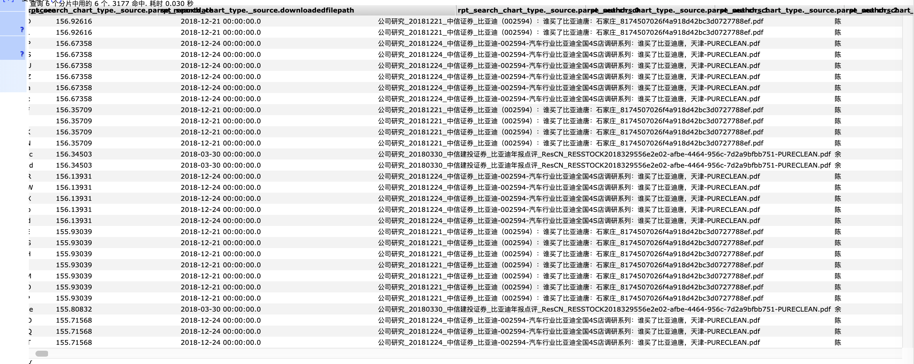


**可以看到，这里边的年报点评就是我们想要的结果，我们需要尽可能的将他的权重提高**

explain 结果:

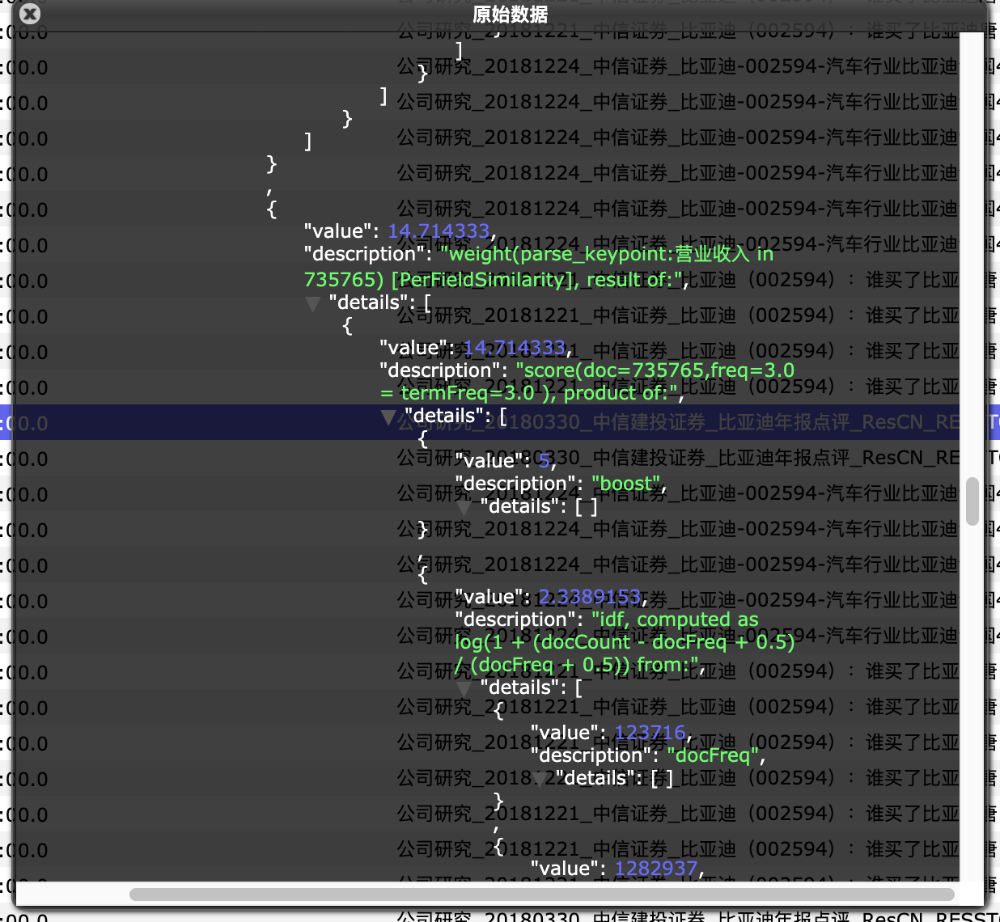

explain 中可以看到 营业收入的 value 仅有 14.7,而且是在 termFreq =3.0 之后的结果，这个结果有些奇怪。


让我们从 DSL 入手重新开始优化


## 优化 DSL 语句

首先删除掉一个无用的层级关系

```json
{
    "from": 0,
    "size": 30,
    "query": {
        "function_score": {
            "query": {
                "bool": {
                    "must": [
                        {
                            "match": {
                                "parse_title": {
                                    "query": "比亚迪营业收入",
                                    "operator": "OR",
                                    "prefix_length": 0,
                                    "max_expansions": 50,
                                    "fuzzy_transpositions": true,
                                    "lenient": false,
                                    "zero_terms_query": "NONE",
                                    "boost": 10
                                }
                            }
                        },
                        {
                            "match": {
                                "parse_keypoint": {
                                    "query": "比亚迪营业收入",
                                    "operator": "OR",
                                    "prefix_length": 0,
                                    "max_expansions": 50,
                                    "fuzzy_transpositions": true,
                                    "lenient": false,
                                    "zero_terms_query": "NONE",
                                    "boost": 5
                                }
                            }
                        }
                    ],
                    "disable_coord": false,
                    "adjust_pure_negative": true,
                    "boost": 1
                }
            },
            "functions": [
                {
                    "filter": {
                        "term": {
                            "parse_type": {
                                "value": "衍生品",
                                "boost": 1
                            }
                        }
                    },
                    "weight": 5
                },
                {
                    "filter": {
                        "term": {
                            "parse_type": {
                                "value": "新三板",
                                "boost": 1
                            }
                        }
                    },
                    "weight": 3
                },
                {
                    "filter": {
                        "term": {
                            "parse_type": {
                                "value": "大宗商品",
                                "boost": 1
                            }
                        }
                    },
                    "weight": 5
                },
                {
                    "filter": {
                        "term": {
                            "parse_type": {
                                "value": "公司研究",
                                "boost": 1
                            }
                        }
                    },
                    "weight": 5
                },
                {
                    "filter": {
                        "term": {
                            "parse_type": {
                                "value": "宏观研究",
                                "boost": 1
                            }
                        }
                    },
                    "weight": 5
                },
                {
                    "filter": {
                        "term": {
                            "parse_type": {
                                "value": "外汇市场",
                                "boost": 1
                            }
                        }
                    },
                    "weight": 5
                },
                {
                    "filter": {
                        "term": {
                            "parse_type": {
                                "value": "策略研究",
                                "boost": 1
                            }
                        }
                    },
                    "weight": 5
                },
                {
                    "filter": {
                        "term": {
                            "parse_type": {
                                "value": "基金研究",
                                "boost": 1
                            }
                        }
                    },
                    "weight": 5
                },
                {
                    "filter": {
                        "term": {
                            "parse_type": {
                                "value": "海外市场",
                                "boost": 1
                            }
                        }
                    },
                    "weight": 5
                },
                {
                    "filter": {
                        "term": {
                            "parse_type": {
                                "value": "月报",
                                "boost": 1
                            }
                        }
                    },
                    "weight": 5
                },
                {
                    "filter": {
                        "term": {
                            "parse_type": {
                                "value": "中小市值",
                                "boost": 1
                            }
                        }
                    },
                    "weight": 5
                },
                {
                    "filter": {
                        "term": {
                            "parse_type": {
                                "value": "金融工程",
                                "boost": 1
                            }
                        }
                    },
                    "weight": 5
                },
                {
                    "filter": {
                        "term": {
                            "parse_type": {
                                "value": "周报",
                                "boost": 1
                            }
                        }
                    },
                    "weight": 4
                },
                {
                    "filter": {
                        "term": {
                            "parse_type": {
                                "value": "行业研究",
                                "boost": 1
                            }
                        }
                    },
                    "weight": 5
                },
                {
                    "filter": {
                        "term": {
                            "parse_type": {
                                "value": "固定收益",
                                "boost": 1
                            }
                        }
                    },
                    "weight": 5
                },
                {
                    "filter": {
                        "term": {
                            "parse_type": {
                                "value": "市场综述",
                                "boost": 1
                            }
                        }
                    },
                    "weight": 5
                },
                {
                    "filter": {
                        "term": {
                            "parse_orgnization": {
                                "value": "方正证券",
                                "boost": 1
                            }
                        }
                    },
                    "weight": 7
                },
                {
                    "filter": {
                        "term": {
                            "parse_orgnization": {
                                "value": "兴业证券",
                                "boost": 1
                            }
                        }
                    },
                    "weight": 8
                },
                {
                    "filter": {
                        "term": {
                            "parse_orgnization": {
                                "value": "申万宏源",
                                "boost": 1
                            }
                        }
                    },
                    "weight": 9
                },
                {
                    "filter": {
                        "term": {
                            "parse_orgnization": {
                                "value": "招商证券",
                                "boost": 1
                            }
                        }
                    },
                    "weight": 8
                },
                {
                    "filter": {
                        "term": {
                            "parse_orgnization": {
                                "value": "中金公司",
                                "boost": 1
                            }
                        }
                    },
                    "weight": 9
                },
                {
                    "filter": {
                        "term": {
                            "parse_orgnization": {
                                "value": "广发证券",
                                "boost": 1
                            }
                        }
                    },
                    "weight": 9
                },
                {
                    "filter": {
                        "term": {
                            "parse_orgnization": {
                                "value": "长江证券",
                                "boost": 1
                            }
                        }
                    },
                    "weight": 8
                },
                {
                    "filter": {
                        "term": {
                            "parse_orgnization": {
                                "value": "海通证券",
                                "boost": 1
                            }
                        }
                    },
                    "weight": 9
                },
                {
                    "filter": {
                        "term": {
                            "parse_orgnization": {
                                "value": "天风证券",
                                "boost": 1
                            }
                        }
                    },
                    "weight": 7
                },
                {
                    "filter": {
                        "term": {
                            "parse_orgnization": {
                                "value": "中信证券",
                                "boost": 1
                            }
                        }
                    },
                    "weight": 10
                },
                {
                    "filter": {
                        "term": {
                            "parse_orgnization": {
                                "value": "中信建投",
                                "boost": 1
                            }
                        }
                    },
                    "weight": 9
                },
                {
                    "filter": {
                        "term": {
                            "parse_orgnization": {
                                "value": "国泰君安",
                                "boost": 1
                            }
                        }
                    },
                    "weight": 9
                },
                {
                    "filter": {
                        "term": {
                            "parse_orgnization": {
                                "value": "华泰证券",
                                "boost": 1
                            }
                        }
                    },
                    "weight": 9
                },
                {
                    "filter": {
                        "term": {
                            "parse_orgnization": {
                                "value": "国信证券",
                                "boost": 1
                            }
                        }
                    },
                    "weight": 8
                },
                {
                    "filter": {
                        "term": {
                            "parse_orgnization": {
                                "value": "平安证券",
                                "boost": 1
                            }
                        }
                    },
                    "weight": 8
                },
                {
                    "filter": {
                        "term": {
                            "parse_orgnization": {
                                "value": "安信证券",
                                "boost": 1
                            }
                        }
                    },
                    "weight": 5
                },
                {
                    "filter": {
                        "match_all": {
                            "boost": 1
                        }
                    },
                    "weight": 1,
                    "exp": {
                        "parse_pagecount": {
                            "origin": 40,
                            "scale": 50,
                            "offset": 5,
                            "decay": 0.5
                        },
                        "multi_value_mode": "MIN"
                    }
                },
                {
                    "filter": {
                        "match_all": {
                            "boost": 1
                        }
                    },
                    "weight": 2,
                    "exp": {
                        "parse_reportdate": {
                            "origin": "now",
                            "scale": "180d",
                            "offset": "90d",
                            "decay": 0.5
                        },
                        "multi_value_mode": "MIN"
                    }
                }
            ],
            "score_mode": "sum",
            "boost_mode": "sum",
            "max_boost": 3.4028235e+38,
            "min_score": 10,
            "boost": 1
        }
    },
    "_source": {
        "includes": [
            "parse_orgnization",
            "parse_authors",
            "parse_pagecount",
            "parse_reportdate",
            "parse_type",
            "tblname",
            "downloadedfilepath",
            "parse_title",
            "parse_keypoint",
            "parse_industry",
            "company"
        ],
        "excludes": []
    },
    "highlight": {
        "require_field_match": false,
        "fields": {
            "parse_title": {},
            "parse_keypoint": {}
        }
    }
}
```

如果我在 title 中采用 OR，然后 body 中采用 AND 匹配


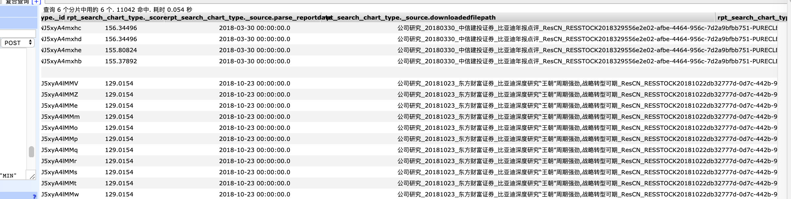

从结果来看，是我们想要的结果，但是这个结果还是不够。


我们需要的优先级: **匹配关键词最多>出现频率**


## 使用 most-fields 查询


查询语句:


```json
{
    "from": 0,
    "size": 30,
    "query": {
        "function_score": {
            "query": {
                "multi_match": {
                    "query": "比亚迪营业收入",
                    "type": "most_fields",
                    "fields": [
                        "parse_title^10",
                        "parse_title.std",
                        "parse_keypoint^5",
                        "parse_keypoint.std"
                    ]
                }
            },
            "functions": [
                {
                    "filter": {
                        "term": {
                            "parse_type": {
                                "value": "衍生品",
                                "boost": 1
                            }
                        }
                    },
                    "weight": 5
                },
                {
                    "filter": {
                        "term": {
                            "parse_type": {
                                "value": "新三板",
                                "boost": 1
                            }
                        }
                    },
                    "weight": 3
                },
                {
                    "filter": {
                        "term": {
                            "parse_type": {
                                "value": "大宗商品",
                                "boost": 1
                            }
                        }
                    },
                    "weight": 5
                },
                {
                    "filter": {
                        "term": {
                            "parse_type": {
                                "value": "公司研究",
                                "boost": 1
                            }
                        }
                    },
                    "weight": 5
                },
                {
                    "filter": {
                        "term": {
                            "parse_type": {
                                "value": "宏观研究",
                                "boost": 1
                            }
                        }
                    },
                    "weight": 5
                },
                {
                    "filter": {
                        "term": {
                            "parse_type": {
                                "value": "外汇市场",
                                "boost": 1
                            }
                        }
                    },
                    "weight": 5
                },
                {
                    "filter": {
                        "term": {
                            "parse_type": {
                                "value": "策略研究",
                                "boost": 1
                            }
                        }
                    },
                    "weight": 5
                },
                {
                    "filter": {
                        "term": {
                            "parse_type": {
                                "value": "基金研究",
                                "boost": 1
                            }
                        }
                    },
                    "weight": 5
                },
                {
                    "filter": {
                        "term": {
                            "parse_type": {
                                "value": "海外市场",
                                "boost": 1
                            }
                        }
                    },
                    "weight": 5
                },
                {
                    "filter": {
                        "term": {
                            "parse_type": {
                                "value": "月报",
                                "boost": 1
                            }
                        }
                    },
                    "weight": 5
                },
                {
                    "filter": {
                        "term": {
                            "parse_type": {
                                "value": "中小市值",
                                "boost": 1
                            }
                        }
                    },
                    "weight": 5
                },
                {
                    "filter": {
                        "term": {
                            "parse_type": {
                                "value": "金融工程",
                                "boost": 1
                            }
                        }
                    },
                    "weight": 5
                },
                {
                    "filter": {
                        "term": {
                            "parse_type": {
                                "value": "周报",
                                "boost": 1
                            }
                        }
                    },
                    "weight": 4
                },
                {
                    "filter": {
                        "term": {
                            "parse_type": {
                                "value": "行业研究",
                                "boost": 1
                            }
                        }
                    },
                    "weight": 5
                },
                {
                    "filter": {
                        "term": {
                            "parse_type": {
                                "value": "固定收益",
                                "boost": 1
                            }
                        }
                    },
                    "weight": 5
                },
                {
                    "filter": {
                        "term": {
                            "parse_type": {
                                "value": "市场综述",
                                "boost": 1
                            }
                        }
                    },
                    "weight": 5
                },
                {
                    "filter": {
                        "term": {
                            "parse_orgnization": {
                                "value": "方正证券",
                                "boost": 1
                            }
                        }
                    },
                    "weight": 7
                },
                {
                    "filter": {
                        "term": {
                            "parse_orgnization": {
                                "value": "兴业证券",
                                "boost": 1
                            }
                        }
                    },
                    "weight": 8
                },
                {
                    "filter": {
                        "term": {
                            "parse_orgnization": {
                                "value": "申万宏源",
                                "boost": 1
                            }
                        }
                    },
                    "weight": 9
                },
                {
                    "filter": {
                        "term": {
                            "parse_orgnization": {
                                "value": "招商证券",
                                "boost": 1
                            }
                        }
                    },
                    "weight": 8
                },
                {
                    "filter": {
                        "term": {
                            "parse_orgnization": {
                                "value": "中金公司",
                                "boost": 1
                            }
                        }
                    },
                    "weight": 9
                },
                {
                    "filter": {
                        "term": {
                            "parse_orgnization": {
                                "value": "广发证券",
                                "boost": 1
                            }
                        }
                    },
                    "weight": 9
                },
                {
                    "filter": {
                        "term": {
                            "parse_orgnization": {
                                "value": "长江证券",
                                "boost": 1
                            }
                        }
                    },
                    "weight": 8
                },
                {
                    "filter": {
                        "term": {
                            "parse_orgnization": {
                                "value": "海通证券",
                                "boost": 1
                            }
                        }
                    },
                    "weight": 9
                },
                {
                    "filter": {
                        "term": {
                            "parse_orgnization": {
                                "value": "天风证券",
                                "boost": 1
                            }
                        }
                    },
                    "weight": 7
                },
                {
                    "filter": {
                        "term": {
                            "parse_orgnization": {
                                "value": "中信证券",
                                "boost": 1
                            }
                        }
                    },
                    "weight": 10
                },
                {
                    "filter": {
                        "term": {
                            "parse_orgnization": {
                                "value": "中信建投",
                                "boost": 1
                            }
                        }
                    },
                    "weight": 9
                },
                {
                    "filter": {
                        "term": {
                            "parse_orgnization": {
                                "value": "国泰君安",
                                "boost": 1
                            }
                        }
                    },
                    "weight": 9
                },
                {
                    "filter": {
                        "term": {
                            "parse_orgnization": {
                                "value": "华泰证券",
                                "boost": 1
                            }
                        }
                    },
                    "weight": 9
                },
                {
                    "filter": {
                        "term": {
                            "parse_orgnization": {
                                "value": "国信证券",
                                "boost": 1
                            }
                        }
                    },
                    "weight": 8
                },
                {
                    "filter": {
                        "term": {
                            "parse_orgnization": {
                                "value": "平安证券",
                                "boost": 1
                            }
                        }
                    },
                    "weight": 8
                },
                {
                    "filter": {
                        "term": {
                            "parse_orgnization": {
                                "value": "安信证券",
                                "boost": 1
                            }
                        }
                    },
                    "weight": 5
                },
                {
                    "filter": {
                        "match_all": {
                            "boost": 1
                        }
                    },
                    "weight": 1,
                    "exp": {
                        "parse_pagecount": {
                            "origin": 40,
                            "scale": 50,
                            "offset": 5,
                            "decay": 0.5
                        },
                        "multi_value_mode": "MIN"
                    }
                },
                {
                    "filter": {
                        "match_all": {
                            "boost": 1
                        }
                    },
                    "weight": 2,
                    "exp": {
                        "parse_reportdate": {
                            "origin": "now",
                            "scale": "180d",
                            "offset": "90d",
                            "decay": 0.5
                        },
                        "multi_value_mode": "MIN"
                    }
                }
            ],
            "score_mode": "sum",
            "boost_mode": "sum",
            "max_boost": 3.4028235e+38,
            "min_score": 10,
            "boost": 1
        }
    },
    "_source": {
        "includes": [
            "parse_orgnization",
            "parse_authors",
            "parse_pagecount",
            "parse_reportdate",
            "parse_type",
            "tblname",
            "downloadedfilepath",
            "parse_title",
            "parse_keypoint",
            "parse_industry",
            "company"
        ],
        "excludes": []
    },
    "highlight": {
        "require_field_match": false,
        "fields": {
            "parse_title": {},
            "parse_keypoint": {}
        }
    }
}
```

主要是合并了 multi match, 得到结果:


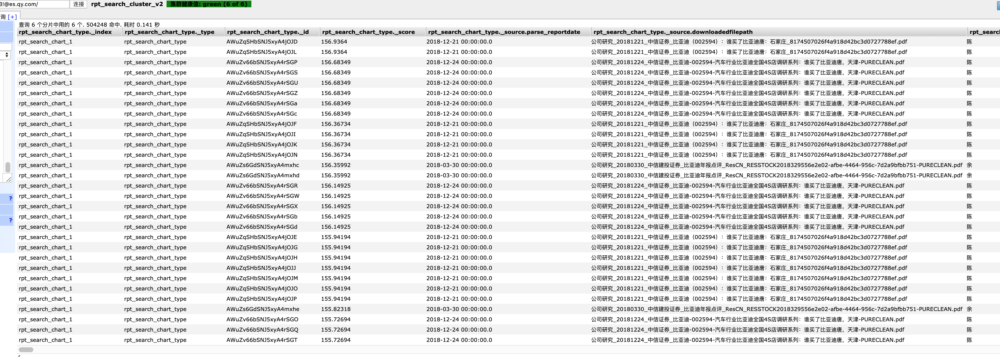


结果是没什么变化的。

## 使用 best-fields 查询

使用 best fields 查询的结果更为惨淡。


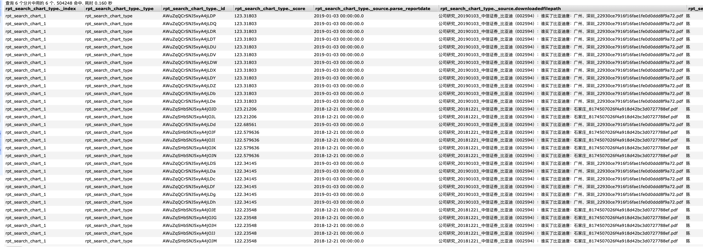


## 使用 cross-fields 查询

查询语句

```json
{
    "from": 0,
    "size": 30,
    "query": {
        "function_score": {
            "query": {
                "multi_match": {
                    "query": "比亚迪营业收入",
                    "type": "cross_fields",
                    "fields": [
                        "parse_title^10",
                        "parse_title.std",
                        "parse_keypoint^5",
                        "parse_keypoint.std"
                    ],
                    "operator":"and"
                }
            },
            "functions": [
                {
                    "filter": {
                        "term": {
                            "parse_type": {
                                "value": "衍生品",
                                "boost": 1
                            }
                        }
                    },
                    "weight": 5
                },
                {
                    "filter": {
                        "term": {
                            "parse_type": {
                                "value": "新三板",
                                "boost": 1
                            }
                        }
                    },
                    "weight": 3
                },
                {
                    "filter": {
                        "term": {
                            "parse_type": {
                                "value": "大宗商品",
                                "boost": 1
                            }
                        }
                    },
                    "weight": 5
                },
                {
                    "filter": {
                        "term": {
                            "parse_type": {
                                "value": "公司研究",
                                "boost": 1
                            }
                        }
                    },
                    "weight": 5
                },
                {
                    "filter": {
                        "term": {
                            "parse_type": {
                                "value": "宏观研究",
                                "boost": 1
                            }
                        }
                    },
                    "weight": 5
                },
                {
                    "filter": {
                        "term": {
                            "parse_type": {
                                "value": "外汇市场",
                                "boost": 1
                            }
                        }
                    },
                    "weight": 5
                },
                {
                    "filter": {
                        "term": {
                            "parse_type": {
                                "value": "策略研究",
                                "boost": 1
                            }
                        }
                    },
                    "weight": 5
                },
                {
                    "filter": {
                        "term": {
                            "parse_type": {
                                "value": "基金研究",
                                "boost": 1
                            }
                        }
                    },
                    "weight": 5
                },
                {
                    "filter": {
                        "term": {
                            "parse_type": {
                                "value": "海外市场",
                                "boost": 1
                            }
                        }
                    },
                    "weight": 5
                },
                {
                    "filter": {
                        "term": {
                            "parse_type": {
                                "value": "月报",
                                "boost": 1
                            }
                        }
                    },
                    "weight": 5
                },
                {
                    "filter": {
                        "term": {
                            "parse_type": {
                                "value": "中小市值",
                                "boost": 1
                            }
                        }
                    },
                    "weight": 5
                },
                {
                    "filter": {
                        "term": {
                            "parse_type": {
                                "value": "金融工程",
                                "boost": 1
                            }
                        }
                    },
                    "weight": 5
                },
                {
                    "filter": {
                        "term": {
                            "parse_type": {
                                "value": "周报",
                                "boost": 1
                            }
                        }
                    },
                    "weight": 4
                },
                {
                    "filter": {
                        "term": {
                            "parse_type": {
                                "value": "行业研究",
                                "boost": 1
                            }
                        }
                    },
                    "weight": 5
                },
                {
                    "filter": {
                        "term": {
                            "parse_type": {
                                "value": "固定收益",
                                "boost": 1
                            }
                        }
                    },
                    "weight": 5
                },
                {
                    "filter": {
                        "term": {
                            "parse_type": {
                                "value": "市场综述",
                                "boost": 1
                            }
                        }
                    },
                    "weight": 5
                },
                {
                    "filter": {
                        "term": {
                            "parse_orgnization": {
                                "value": "方正证券",
                                "boost": 1
                            }
                        }
                    },
                    "weight": 7
                },
                {
                    "filter": {
                        "term": {
                            "parse_orgnization": {
                                "value": "兴业证券",
                                "boost": 1
                            }
                        }
                    },
                    "weight": 8
                },
                {
                    "filter": {
                        "term": {
                            "parse_orgnization": {
                                "value": "申万宏源",
                                "boost": 1
                            }
                        }
                    },
                    "weight": 9
                },
                {
                    "filter": {
                        "term": {
                            "parse_orgnization": {
                                "value": "招商证券",
                                "boost": 1
                            }
                        }
                    },
                    "weight": 8
                },
                {
                    "filter": {
                        "term": {
                            "parse_orgnization": {
                                "value": "中金公司",
                                "boost": 1
                            }
                        }
                    },
                    "weight": 9
                },
                {
                    "filter": {
                        "term": {
                            "parse_orgnization": {
                                "value": "广发证券",
                                "boost": 1
                            }
                        }
                    },
                    "weight": 9
                },
                {
                    "filter": {
                        "term": {
                            "parse_orgnization": {
                                "value": "长江证券",
                                "boost": 1
                            }
                        }
                    },
                    "weight": 8
                },
                {
                    "filter": {
                        "term": {
                            "parse_orgnization": {
                                "value": "海通证券",
                                "boost": 1
                            }
                        }
                    },
                    "weight": 9
                },
                {
                    "filter": {
                        "term": {
                            "parse_orgnization": {
                                "value": "天风证券",
                                "boost": 1
                            }
                        }
                    },
                    "weight": 7
                },
                {
                    "filter": {
                        "term": {
                            "parse_orgnization": {
                                "value": "中信证券",
                                "boost": 1
                            }
                        }
                    },
                    "weight": 10
                },
                {
                    "filter": {
                        "term": {
                            "parse_orgnization": {
                                "value": "中信建投",
                                "boost": 1
                            }
                        }
                    },
                    "weight": 9
                },
                {
                    "filter": {
                        "term": {
                            "parse_orgnization": {
                                "value": "国泰君安",
                                "boost": 1
                            }
                        }
                    },
                    "weight": 9
                },
                {
                    "filter": {
                        "term": {
                            "parse_orgnization": {
                                "value": "华泰证券",
                                "boost": 1
                            }
                        }
                    },
                    "weight": 9
                },
                {
                    "filter": {
                        "term": {
                            "parse_orgnization": {
                                "value": "国信证券",
                                "boost": 1
                            }
                        }
                    },
                    "weight": 8
                },
                {
                    "filter": {
                        "term": {
                            "parse_orgnization": {
                                "value": "平安证券",
                                "boost": 1
                            }
                        }
                    },
                    "weight": 8
                },
                {
                    "filter": {
                        "term": {
                            "parse_orgnization": {
                                "value": "安信证券",
                                "boost": 1
                            }
                        }
                    },
                    "weight": 5
                },
                {
                    "filter": {
                        "match_all": {
                            "boost": 1
                        }
                    },
                    "weight": 1,
                    "exp": {
                        "parse_pagecount": {
                            "origin": 40,
                            "scale": 50,
                            "offset": 5,
                            "decay": 0.5
                        },
                        "multi_value_mode": "MIN"
                    }
                },
                {
                    "filter": {
                        "match_all": {
                            "boost": 1
                        }
                    },
                    "weight": 2,
                    "exp": {
                        "parse_reportdate": {
                            "origin": "now",
                            "scale": "180d",
                            "offset": "90d",
                            "decay": 0.5
                        },
                        "multi_value_mode": "MIN"
                    }
                }
            ],
            "score_mode": "sum",
            "boost_mode": "sum",
            "max_boost": 3.4028235e+38,
            "min_score": 10,
            "boost": 1
        }
    },
    "_source": {
        "includes": [
            "parse_orgnization",
            "parse_authors",
            "parse_pagecount",
            "parse_reportdate",
            "parse_type",
            "tblname",
            "downloadedfilepath",
            "parse_title",
            "parse_keypoint",
            "parse_industry",
            "company"
        ],
        "excludes": []
    },
    "highlight": {
        "require_field_match": false,
        "fields": {
            "parse_title": {},
            "parse_keypoint": {}
        }
    }
}
```


结果如下:

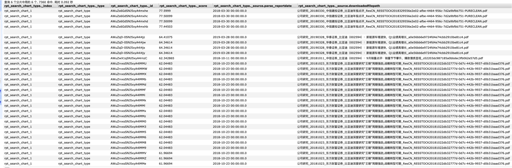


就目前来看，这个结果是比较令人满意的，但是我们考虑下这个有没有可能有更好的提升呢？目前 cross-field 匹配成功，但是关于比亚迪的其他信息没有匹配。


## 添加 boost 以及一些原有的规则


```json
{
    "from": 0,
    "size": 30,
    "query": {
        "function_score": {
            "query": {
                "bool": {
                    "should": [
                        {
                            "multi_match": {
                                "query": "比亚迪营业收入",
                                "type": "cross_fields",
                                "fields": [
                                    "parse_title^10",
                                    "parse_title.std",
                                    "parse_keypoint^5",
                                    "parse_keypoint.std"
                                ],
                                "boost": 1,
                                "prefix_length": 0,
                                "max_expansions": 50,
                                "lenient": false,
                                "zero_terms_query": "NONE",
                                "operator": "and"
                            }
                        },
                        {
                            "multi_match": {
                                "query": "比亚迪营业收入",
                                "type": "best_fields",
                                "fields": [
                                    "parse_title^10",
                                    "parse_title.std",
                                    "parse_keypoint^5",
                                    "parse_keypoint.std"
                                ],
                                "boost": 0.5,
                                "prefix_length": 0,
                                "max_expansions": 50,
                                "lenient": false,
                                "zero_terms_query": "NONE"
                            }
                        }
                    ]
                }
            },
            "functions": [
                {
                    "filter": {
                        "term": {
                            "parse_type": {
                                "value": "衍生品",
                                "boost": 1
                            }
                        }
                    },
                    "weight": 5
                },
                {
                    "filter": {
                        "term": {
                            "parse_type": {
                                "value": "新三板",
                                "boost": 1
                            }
                        }
                    },
                    "weight": 3
                },
                {
                    "filter": {
                        "term": {
                            "parse_type": {
                                "value": "大宗商品",
                                "boost": 1
                            }
                        }
                    },
                    "weight": 5
                },
                {
                    "filter": {
                        "term": {
                            "parse_type": {
                                "value": "公司研究",
                                "boost": 1
                            }
                        }
                    },
                    "weight": 5
                },
                {
                    "filter": {
                        "term": {
                            "parse_type": {
                                "value": "宏观研究",
                                "boost": 1
                            }
                        }
                    },
                    "weight": 5
                },
                {
                    "filter": {
                        "term": {
                            "parse_type": {
                                "value": "外汇市场",
                                "boost": 1
                            }
                        }
                    },
                    "weight": 5
                },
                {
                    "filter": {
                        "term": {
                            "parse_type": {
                                "value": "策略研究",
                                "boost": 1
                            }
                        }
                    },
                    "weight": 5
                },
                {
                    "filter": {
                        "term": {
                            "parse_type": {
                                "value": "基金研究",
                                "boost": 1
                            }
                        }
                    },
                    "weight": 5
                },
                {
                    "filter": {
                        "term": {
                            "parse_type": {
                                "value": "海外市场",
                                "boost": 1
                            }
                        }
                    },
                    "weight": 5
                },
                {
                    "filter": {
                        "term": {
                            "parse_type": {
                                "value": "月报",
                                "boost": 1
                            }
                        }
                    },
                    "weight": 5
                },
                {
                    "filter": {
                        "term": {
                            "parse_type": {
                                "value": "中小市值",
                                "boost": 1
                            }
                        }
                    },
                    "weight": 5
                },
                {
                    "filter": {
                        "term": {
                            "parse_type": {
                                "value": "金融工程",
                                "boost": 1
                            }
                        }
                    },
                    "weight": 5
                },
                {
                    "filter": {
                        "term": {
                            "parse_type": {
                                "value": "周报",
                                "boost": 1
                            }
                        }
                    },
                    "weight": 4
                },
                {
                    "filter": {
                        "term": {
                            "parse_type": {
                                "value": "行业研究",
                                "boost": 1
                            }
                        }
                    },
                    "weight": 5
                },
                {
                    "filter": {
                        "term": {
                            "parse_type": {
                                "value": "固定收益",
                                "boost": 1
                            }
                        }
                    },
                    "weight": 5
                },
                {
                    "filter": {
                        "term": {
                            "parse_type": {
                                "value": "市场综述",
                                "boost": 1
                            }
                        }
                    },
                    "weight": 5
                },
                {
                    "filter": {
                        "term": {
                            "parse_orgnization": {
                                "value": "方正证券",
                                "boost": 1
                            }
                        }
                    },
                    "weight": 7
                },
                {
                    "filter": {
                        "term": {
                            "parse_orgnization": {
                                "value": "兴业证券",
                                "boost": 1
                            }
                        }
                    },
                    "weight": 8
                },
                {
                    "filter": {
                        "term": {
                            "parse_orgnization": {
                                "value": "申万宏源",
                                "boost": 1
                            }
                        }
                    },
                    "weight": 9
                },
                {
                    "filter": {
                        "term": {
                            "parse_orgnization": {
                                "value": "招商证券",
                                "boost": 1
                            }
                        }
                    },
                    "weight": 8
                },
                {
                    "filter": {
                        "term": {
                            "parse_orgnization": {
                                "value": "中金公司",
                                "boost": 1
                            }
                        }
                    },
                    "weight": 9
                },
                {
                    "filter": {
                        "term": {
                            "parse_orgnization": {
                                "value": "广发证券",
                                "boost": 1
                            }
                        }
                    },
                    "weight": 9
                },
                {
                    "filter": {
                        "term": {
                            "parse_orgnization": {
                                "value": "长江证券",
                                "boost": 1
                            }
                        }
                    },
                    "weight": 8
                },
                {
                    "filter": {
                        "term": {
                            "parse_orgnization": {
                                "value": "海通证券",
                                "boost": 1
                            }
                        }
                    },
                    "weight": 9
                },
                {
                    "filter": {
                        "term": {
                            "parse_orgnization": {
                                "value": "天风证券",
                                "boost": 1
                            }
                        }
                    },
                    "weight": 7
                },
                {
                    "filter": {
                        "term": {
                            "parse_orgnization": {
                                "value": "中信证券",
                                "boost": 1
                            }
                        }
                    },
                    "weight": 10
                },
                {
                    "filter": {
                        "term": {
                            "parse_orgnization": {
                                "value": "中信建投",
                                "boost": 1
                            }
                        }
                    },
                    "weight": 9
                },
                {
                    "filter": {
                        "term": {
                            "parse_orgnization": {
                                "value": "国泰君安",
                                "boost": 1
                            }
                        }
                    },
                    "weight": 9
                },
                {
                    "filter": {
                        "term": {
                            "parse_orgnization": {
                                "value": "华泰证券",
                                "boost": 1
                            }
                        }
                    },
                    "weight": 9
                },
                {
                    "filter": {
                        "term": {
                            "parse_orgnization": {
                                "value": "国信证券",
                                "boost": 1
                            }
                        }
                    },
                    "weight": 8
                },
                {
                    "filter": {
                        "term": {
                            "parse_orgnization": {
                                "value": "平安证券",
                                "boost": 1
                            }
                        }
                    },
                    "weight": 8
                },
                {
                    "filter": {
                        "term": {
                            "parse_orgnization": {
                                "value": "安信证券",
                                "boost": 1
                            }
                        }
                    },
                    "weight": 5
                },
                {
                    "filter": {
                        "match_all": {
                            "boost": 1
                        }
                    },
                    "weight": 1,
                    "exp": {
                        "parse_pagecount": {
                            "origin": 40,
                            "scale": 50,
                            "offset": 5,
                            "decay": 0.5
                        },
                        "multi_value_mode": "MIN"
                    }
                },
                {
                    "filter": {
                        "match_all": {
                            "boost": 1
                        }
                    },
                    "weight": 2,
                    "exp": {
                        "parse_reportdate": {
                            "origin": "now",
                            "scale": "180d",
                            "offset": "90d",
                            "decay": 0.5
                        },
                        "multi_value_mode": "MIN"
                    }
                }
            ],
            "score_mode": "sum",
            "boost_mode": "sum",
            "max_boost": 3.4028235e+38,
            "min_score": 10,
            "boost": 1
        }
    },
    "_source": {
        "includes": [
            "parse_orgnization",
            "parse_authors",
            "parse_pagecount",
            "parse_reportdate",
            "parse_type",
            "tblname",
            "downloadedfilepath",
            "parse_title",
            "parse_keypoint",
            "parse_industry",
            "company"
        ],
        "excludes": []
    },
    "highlight": {
        "require_field_match": false,
        "fields": {
            "parse_title": {},
            "parse_keypoint": {}
        }
    }
}
```

结果还是不错的:

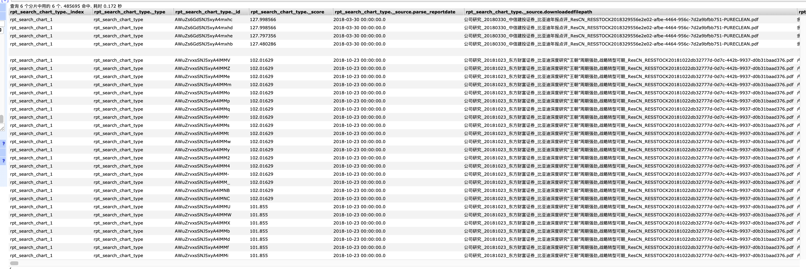


看一下对应的分数计算是否符合预期

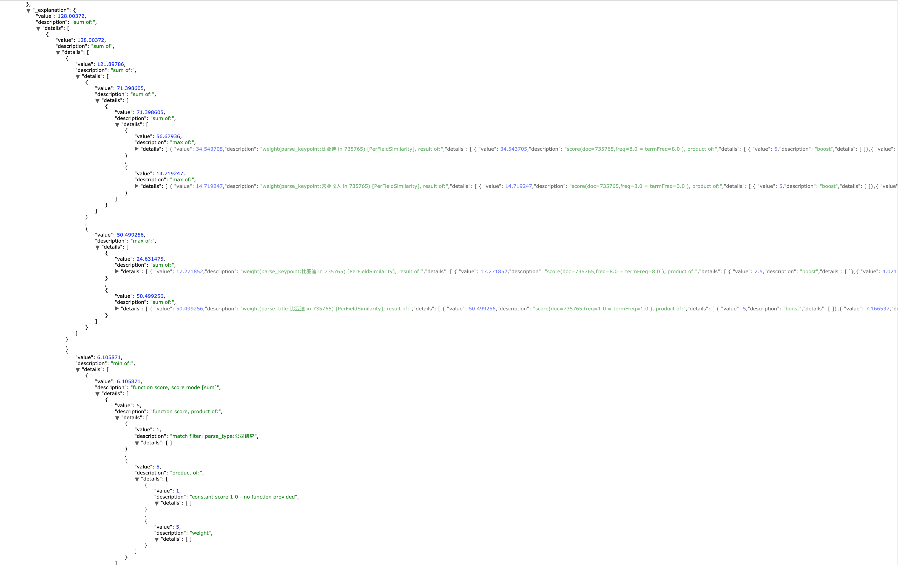

可以看到最终的分数符合预期，至此优化结束。


## 总结

最终请求的 DSL 为:


```json
{
    "from": 0,
    "size": 30,
    "query": {
        "function_score": {
            "query": {
                "bool": {
                    "should": [
                        {
                            "multi_match": {
                                "query": "比亚迪营业收入",
                                "type": "cross_fields",
                                "fields": [
                                    "parse_title^10",
                                    "parse_title.std",
                                    "parse_keypoint^5",
                                    "parse_keypoint.std"
                                ],
                                "boost": 1,
                                "prefix_length": 0,
                                "max_expansions": 50,
                                "lenient": false,
                                "zero_terms_query": "NONE",
                                "operator": "and"
                            }
                        },
                        {
                            "multi_match": {
                                "query": "比亚迪营业收入",
                                "type": "best_fields",
                                "fields": [
                                    "parse_title^10",
                                    "parse_title.std",
                                    "parse_keypoint^5",
                                    "parse_keypoint.std"
                                ],
                                "boost": 0.5,
                                "prefix_length": 0,
                                "max_expansions": 50,
                                "lenient": false,
                                "zero_terms_query": "NONE"
                            }
                        }
                    ]
                }
            },
            "functions": [
                {
                    "filter": {
                        "term": {
                            "parse_type": {
                                "value": "衍生品",
                                "boost": 1
                            }
                        }
                    },
                    "weight": 5
                },
                {
                    "filter": {
                        "term": {
                            "parse_type": {
                                "value": "新三板",
                                "boost": 1
                            }
                        }
                    },
                    "weight": 3
                },
                {
                    "filter": {
                        "term": {
                            "parse_type": {
                                "value": "大宗商品",
                                "boost": 1
                            }
                        }
                    },
                    "weight": 5
                },
                {
                    "filter": {
                        "term": {
                            "parse_type": {
                                "value": "公司研究",
                                "boost": 1
                            }
                        }
                    },
                    "weight": 5
                },
                {
                    "filter": {
                        "term": {
                            "parse_type": {
                                "value": "宏观研究",
                                "boost": 1
                            }
                        }
                    },
                    "weight": 5
                },
                {
                    "filter": {
                        "term": {
                            "parse_type": {
                                "value": "外汇市场",
                                "boost": 1
                            }
                        }
                    },
                    "weight": 5
                },
                {
                    "filter": {
                        "term": {
                            "parse_type": {
                                "value": "策略研究",
                                "boost": 1
                            }
                        }
                    },
                    "weight": 5
                },
                {
                    "filter": {
                        "term": {
                            "parse_type": {
                                "value": "基金研究",
                                "boost": 1
                            }
                        }
                    },
                    "weight": 5
                },
                {
                    "filter": {
                        "term": {
                            "parse_type": {
                                "value": "海外市场",
                                "boost": 1
                            }
                        }
                    },
                    "weight": 5
                },
                {
                    "filter": {
                        "term": {
                            "parse_type": {
                                "value": "月报",
                                "boost": 1
                            }
                        }
                    },
                    "weight": 5
                },
                {
                    "filter": {
                        "term": {
                            "parse_type": {
                                "value": "中小市值",
                                "boost": 1
                            }
                        }
                    },
                    "weight": 5
                },
                {
                    "filter": {
                        "term": {
                            "parse_type": {
                                "value": "金融工程",
                                "boost": 1
                            }
                        }
                    },
                    "weight": 5
                },
                {
                    "filter": {
                        "term": {
                            "parse_type": {
                                "value": "周报",
                                "boost": 1
                            }
                        }
                    },
                    "weight": 4
                },
                {
                    "filter": {
                        "term": {
                            "parse_type": {
                                "value": "行业研究",
                                "boost": 1
                            }
                        }
                    },
                    "weight": 5
                },
                {
                    "filter": {
                        "term": {
                            "parse_type": {
                                "value": "固定收益",
                                "boost": 1
                            }
                        }
                    },
                    "weight": 5
                },
                {
                    "filter": {
                        "term": {
                            "parse_type": {
                                "value": "市场综述",
                                "boost": 1
                            }
                        }
                    },
                    "weight": 5
                },
                {
                    "filter": {
                        "term": {
                            "parse_orgnization": {
                                "value": "方正证券",
                                "boost": 1
                            }
                        }
                    },
                    "weight": 7
                },
                {
                    "filter": {
                        "term": {
                            "parse_orgnization": {
                                "value": "兴业证券",
                                "boost": 1
                            }
                        }
                    },
                    "weight": 8
                },
                {
                    "filter": {
                        "term": {
                            "parse_orgnization": {
                                "value": "申万宏源",
                                "boost": 1
                            }
                        }
                    },
                    "weight": 9
                },
                {
                    "filter": {
                        "term": {
                            "parse_orgnization": {
                                "value": "招商证券",
                                "boost": 1
                            }
                        }
                    },
                    "weight": 8
                },
                {
                    "filter": {
                        "term": {
                            "parse_orgnization": {
                                "value": "中金公司",
                                "boost": 1
                            }
                        }
                    },
                    "weight": 9
                },
                {
                    "filter": {
                        "term": {
                            "parse_orgnization": {
                                "value": "广发证券",
                                "boost": 1
                            }
                        }
                    },
                    "weight": 9
                },
                {
                    "filter": {
                        "term": {
                            "parse_orgnization": {
                                "value": "长江证券",
                                "boost": 1
                            }
                        }
                    },
                    "weight": 8
                },
                {
                    "filter": {
                        "term": {
                            "parse_orgnization": {
                                "value": "海通证券",
                                "boost": 1
                            }
                        }
                    },
                    "weight": 9
                },
                {
                    "filter": {
                        "term": {
                            "parse_orgnization": {
                                "value": "天风证券",
                                "boost": 1
                            }
                        }
                    },
                    "weight": 7
                },
                {
                    "filter": {
                        "term": {
                            "parse_orgnization": {
                                "value": "中信证券",
                                "boost": 1
                            }
                        }
                    },
                    "weight": 10
                },
                {
                    "filter": {
                        "term": {
                            "parse_orgnization": {
                                "value": "中信建投",
                                "boost": 1
                            }
                        }
                    },
                    "weight": 9
                },
                {
                    "filter": {
                        "term": {
                            "parse_orgnization": {
                                "value": "国泰君安",
                                "boost": 1
                            }
                        }
                    },
                    "weight": 9
                },
                {
                    "filter": {
                        "term": {
                            "parse_orgnization": {
                                "value": "华泰证券",
                                "boost": 1
                            }
                        }
                    },
                    "weight": 9
                },
                {
                    "filter": {
                        "term": {
                            "parse_orgnization": {
                                "value": "国信证券",
                                "boost": 1
                            }
                        }
                    },
                    "weight": 8
                },
                {
                    "filter": {
                        "term": {
                            "parse_orgnization": {
                                "value": "平安证券",
                                "boost": 1
                            }
                        }
                    },
                    "weight": 8
                },
                {
                    "filter": {
                        "term": {
                            "parse_orgnization": {
                                "value": "安信证券",
                                "boost": 1
                            }
                        }
                    },
                    "weight": 5
                },
                {
                    "filter": {
                        "match_all": {
                            "boost": 1
                        }
                    },
                    "weight": 1,
                    "exp": {
                        "parse_pagecount": {
                            "origin": 40,
                            "scale": 50,
                            "offset": 5,
                            "decay": 0.5
                        },
                        "multi_value_mode": "MIN"
                    }
                },
                {
                    "filter": {
                        "match_all": {
                            "boost": 1
                        }
                    },
                    "weight": 2,
                    "exp": {
                        "parse_reportdate": {
                            "origin": "now",
                            "scale": "180d",
                            "offset": "90d",
                            "decay": 0.5
                        },
                        "multi_value_mode": "MIN"
                    }
                }
            ],
            "score_mode": "sum",
            "boost_mode": "sum",
            "max_boost": 3.4028235e+38,
            "min_score": 10,
            "boost": 1
        }
    },
    "_source": {
        "includes": [
            "parse_orgnization",
            "parse_authors",
            "parse_pagecount",
            "parse_reportdate",
            "parse_type",
            "tblname",
            "downloadedfilepath",
            "parse_title",
            "parse_keypoint",
            "parse_industry",
            "company"
        ],
        "excludes": []
    },
    "highlight": {
        "require_field_match": false,
        "fields": {
            "parse_title": {},
            "parse_keypoint": {}
        }
    }
}
```

