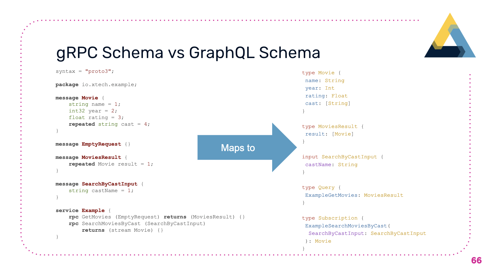

We really enjoy working with GraphQL, because it is a declarative way to set up data endpoints for the frontend. Often times our team gets together and works on the GraphQL schema at the start of the project, and then we can split our teams into frontend and backend to work on each part of the stack. We like gRPC for pretty much the same reason, with the extra benefit of leveraging certain language features (e.g. JVM languages works better with Kafka), and the ability to quickly collaborate with developers of different language expertise.

Why not combine the two? Have a gRPC service directly mapped to GraphQL, so we can have frontend engineers directly work based on the schema definition, and have backend engineers design and build the best service they can put together for the job. I was contemplating the idea until I found a chance in a small prototype project, where I asked a freelancer in my network, who is a Python developer, to quickly build a backend service with 4 endpoints, in gRPC. I started a quick prototype, in about 150 lines of JavaScript code, to map the gRPC protobuf service definition into GraphQL Schema, and stood up a GraphQL Server to connect to the service. Later on we worked on another project where we needed to connect a Kafka Stream to frontend and stream the live results, so I extended my previous prototype more to support mapping streaming endpoints into subscriptions, and also re-wrote in TypeScript. Later on we have published the module [on GitHub](https://github.com/xanthous-tech/grpc-graphql-schema) and also gave a small talk at a [GraphQL Meetup in Bangkok](https://docs.google.com/presentation/d/1OzSXKrSO3mzDrS4316HQBWjUC3YezCS-SuqIfLk--8o/edit?ts=5c2335df#slide=id.g4d5154804a_1_0).

I have jotted down some findings in the slides, and I find it very interesting for some of the design choices I made. I hope you find this library useful, and feel free to send us an issue or a PR to discuss more about it!