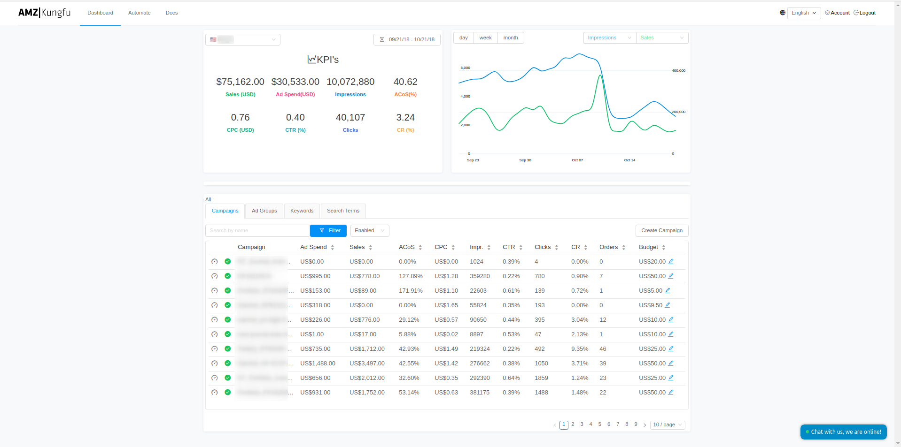
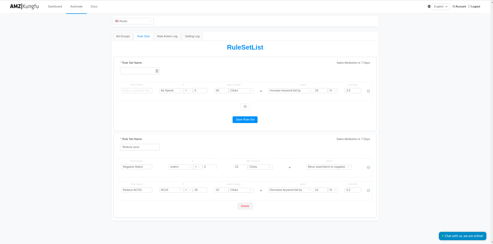

Our client AMZKungFu, came in with a request where they want to help Amazon sellers analyze their seller ads performance. There is an hourly report we can get from Amazon's Seller Central, and based on the metrics in the reports, we will need to adjust the ad spending and ad bids based on pre-defined rules by the sellers themselves.

Since the report comes out every hour, we built a fully reactive data pipeline that collects the data, and runs the metrics through the rule engine, and the rule engine will react to the value changes and adjust the ad spend accordingly. This way, the sellers can optimize every dollar they spend on the ads programmatically.

We carefully dissect the problem presented, and looked into the data in the reports, and at the end, we built the data pipeline with Serverless technology on AWS, and our final product is able to crunch through hundreds of thousands of data points within minutes. Also with AWS Lambda, it showed a lot of cost benefits to our client, and host cost is very small for the amount of data we process in the pipeline.

The processed metrics are then stored in Elasticsearch so we can quickly build out dashboards that shows the change of ad spend vs sales revenue in a time graph, which helps the sellers immensely on seeing the insights of their ad performance, and make intelligent decisions for their e-commerce businesses on Amazon.

