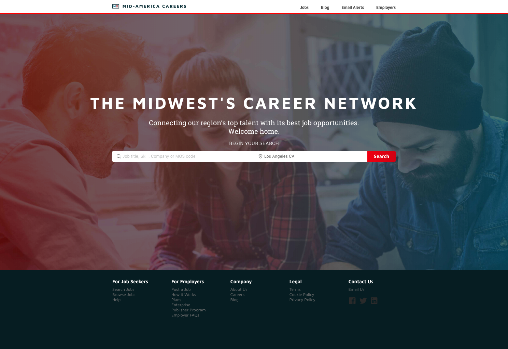
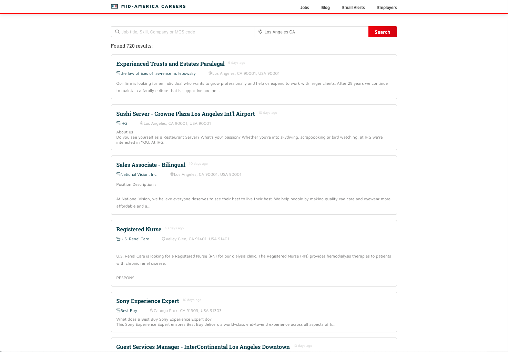
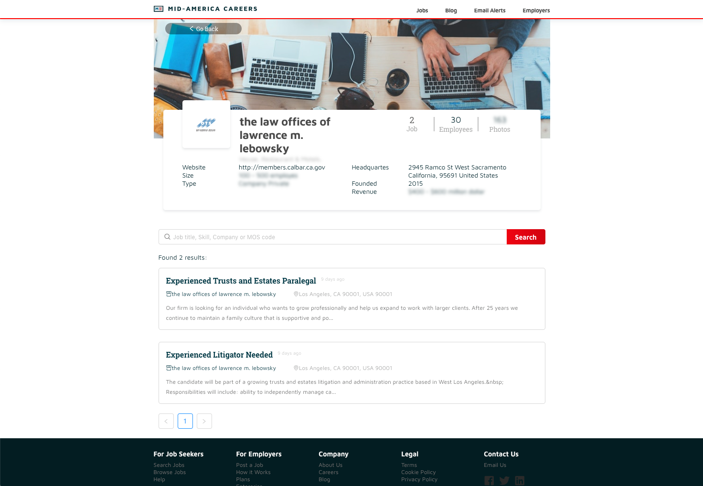
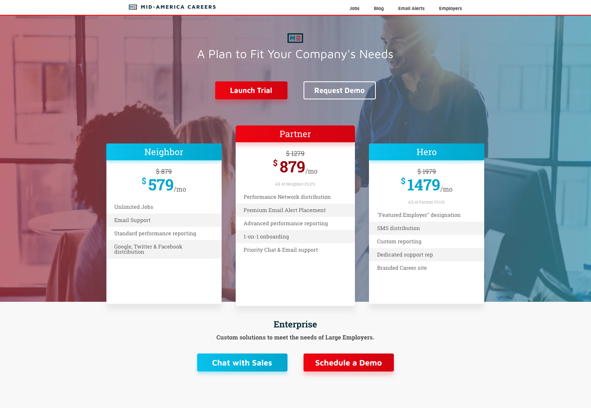
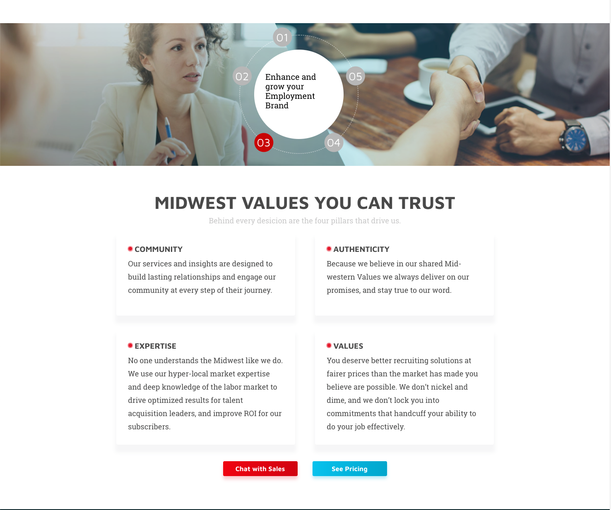

Client approached us with the need of building a search engine that could surface his hundreds of thousands of job posts on his website, making it discoverable and searchable by title and location.

As we looked into the existing solution of the client, we found that the source document wasn't as discoverable as we thought - the site search functionality was slow and wasn't able to surface all of the jobs in the pool.

After looking into how client's job sources, we decided to start from the source and index the data directly, growing out an in-house database of job posts for the client. We get XML files updated periodically from the upstream, in which we need to download, and parse, and import into database for indexing. At the end, we were able to search for hundreds of thousands of job posts within seconds.

Client was happy about what we did, so we were continuing to support the Tech operations for them for the entire 2018. We helped them re-build the website in React and Gatsby, with a brand new design that is more vibrant and millenial-friendly. We also added company sections to provide more insights about the companies, and also allow the individual companies to enrich their own content on the website. We continued to improve the indexing pipeline and effectively cut down indexing times (from 6 hours to 15 minutes), and hosting costs by moving to Serverless Architecture with AWS Lambda.

